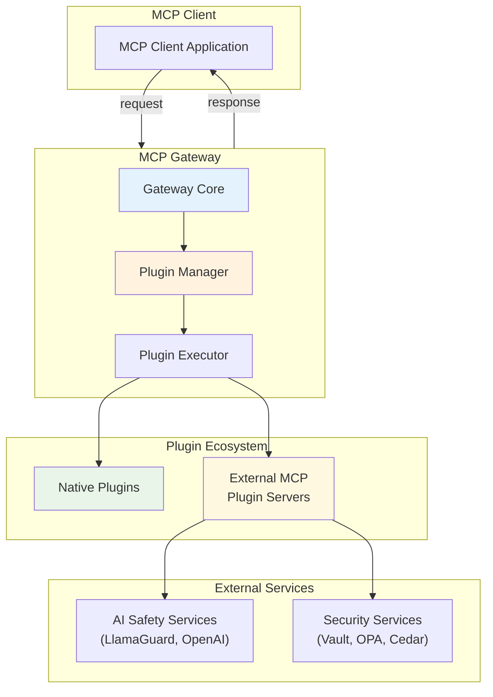
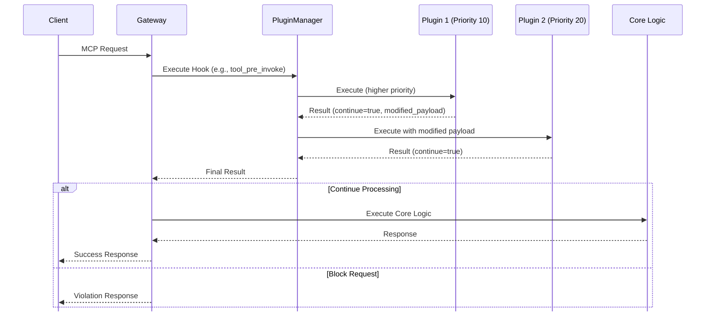
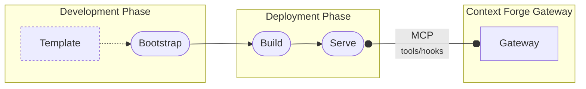
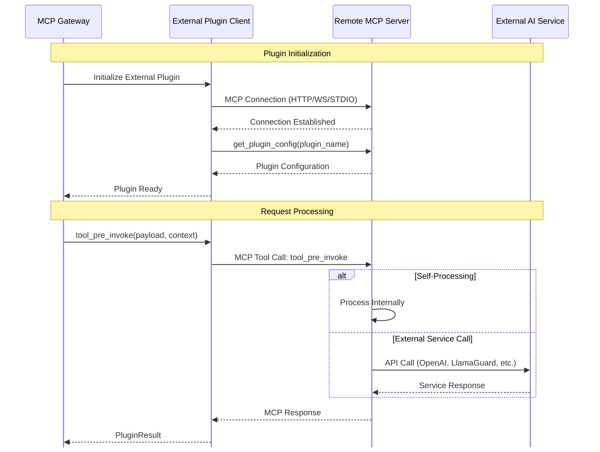
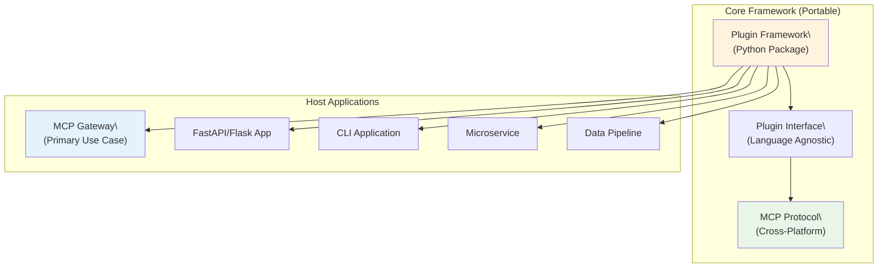

# Plugin Framework Specification

**Version**: 1.0
**Status**: Draft

The MCP Context Forge Plugin Framework provides a comprehensive, production-ready system for extending MCP Gateway functionality through pluggable middleware components. These plugins interpose calls to MCP and agentic components to apply security, AI, business logic, and monitoring capabilities to existing flows. This specification defines the architecture, interfaces, and protocols for developing, deploying, and managing plugins within the MCP ecosystem.

## Table of Contents

1. [Overview](#overview)
2. [Architecture](#architecture)
3. [Plugin Types and Configuration](#plugin-types-and-configuration)
4. [Core Components](#core-components)
5. [Hook System](#hook-system)
6. [Hook Reference Documentation](#hook-reference-documentation)
7. [External Plugin Integration](#external-plugin-integration)
8. [Security and Protection](#security-and-protection)
9. [Performance Considerations](#performance-considerations)
10. [Development Guidelines](#development-guidelines)
11. [Testing](#testing)
12. [Platform-Agnostic Design](#platform-agnostic-design)
13. [Future Extensions](#future-extensions)

## Overview

The plugin framework is designed as a **standalone, platform-agnostic ecosystem** that can be embedded in any application requiring extensible middleware processing. It enables both **native plugins** (running in-process) and **external plugin integrations** (remote MCP servers) through a unified interface. This approach balances performance, security, and operational requirements while providing maximum flexibility for deployment across different environments and platforms.

### Design Principles

1. **Platform Agnostic**: The Framework is implemented in Python, but external plugins can be implemented in any language of choice.
2. **Protocol Neutral**: Supports multiple transport mechanisms (Streamable HTTP (JSON-RPC), STDIO, SSE), and can be extended to support additional protocols
3. **MCP Native**: Remote plugins are fully compliant MCP servers
4. **Security First**: Comprehensive protection, validation, and isolation
5. **Production Ready**: Built for high-throughput, low-latency environments
6. **Developer Friendly**: Simple APIs with comprehensive tooling

### Terminology

- **Plugin**: A middleware component that processes MCP requests/responses
- **Hook**: A specific point in the MCP lifecycle where plugins execute
- **Native Plugin**: Plugin running in-process with the gateway
- **External Plugin**: Plugin running as a remote MCP server
- **Plugin Manager**: Core service managing plugin lifecycle and execution
- **Plugin Context**: Request-scoped state shared between plugins
- **Plugin Configuration**: YAML-based plugin setup and parameters

### Features

Legend: ✅ = Completed | 🚧 = In Progress | 📋 = Planned

**Plugin Lifecycle Management**

- ✅ **Discovery & Loading**: Automatically discover and load plugins from configuration
- 📋 **Dependency Resolution**: Handle plugin dependencies and load order
- ✅ **Runtime Control**: Enable, disable, or modify plugin behavior without code changes
- ✅ **Version Management**: Track plugin versions and manage updates

**Operational Control**

- 🚧 **Environment-Specific Deployment**: Different configurations for dev/staging/production
- ✅ **Conditional Execution**: Run plugins only under specific conditions (tenant, server, user)
- ✅ **Priority-Based Orchestration**: Control execution order through priority settings
- ✅ **Mode-Based Behavior**: Switch between enforce/enforce_ignore_error/permissive/disabled modes

**Security & Compliance**

- ✅ **Conditional Execution**: Restrict plugin execution to specific users, tools, or servers
- ✅ **Audit Trail**: Track plugin configuration changes and deployment history
- ✅ **Policy Enforcement**: Implement organizational security policies through configuration
- 📋 **External Service Integration**: Securely configure connections to external AI safety services

**Performance Optimization**

- ✅ **Resource Limits**: Configure timeouts, memory limits, and execution constraints
- 📋 **Selective Loading**: Load only necessary plugins to optimize performance
- ✅ **Monitoring Integration**: Configure metrics collection and health monitoring
- 📋 **Caching Strategies**: Control plugin result caching and optimization

## Architecture

The plugin framework implements an execution pipeline designed for enterprise-grade performance, security, and reliability.

### Component View

Below is a view of the core components of the plugin system, which extends the gateway request execution pipeline with pre- and post- protocol hooks implemented by plugins.



## Plugin Types and Configuration

The plugin configuration system provides a declarative, YAML-based approach to plugin management, deployment, and orchestration.

The configuration system supports both **native plugins** (running in-process) and **external plugins** (remote MCP servers), providing a unified interface for managing diverse plugin architectures while maintaining type safety, validation, and operational excellence.

### Plugin Deployment Patterns

The framework supports two distinct plugin deployment patterns:

#### **Native Plugins** (In-Process)
- Execute within the main application process
- Written in Python and extend the base `Plugin` class
- Fastest execution with shared memory access
- Examples: regex filters, simple transforms, validation

#### **External Plugins** (Remote MCP Servers)
- Standalone MCP servers implementing plugin logic
- Can be written in any language (Python, TypeScript, Go, Rust, etc.)
- Communicate via MCP protocol (Streamable HTTP over TCP or UDS, STDIO, SSE)
- Examples: OPA filter, Cedar Policy Plugin (RBAC), LlamaGuard, OpenAI Moderation, custom AI services

### Plugin Configuration Schema

Below is an example of a plugin configuration file. A plugin configuration file can configure one or more plugins in a prioritized list as below. Each individual plugin is an instance of the of a plugin class that subclasses the base `Plugin` object and implements a set of hooks as listed in the configuration.

```yaml
# plugins/config.yaml
plugins:

  - name: "PIIFilterPlugin"                    # Unique plugin identifier
    kind: "plugins.pii_filter.pii_filter.PIIFilterPlugin"  # Plugin class path
    description: "Detects and masks PII"       # Human-readable description
    version: "1.0.0"                          # Plugin version
    author: "Security Team"                   # Plugin author
    hooks:                                    # Hook registration

      - "prompt_pre_fetch"
      - "tool_pre_invoke"
      - "tool_post_invoke"
    tags:                                     # Searchable tags

      - "security"
      - "pii"
      - "compliance"
    mode: "enforce"                           # enforce|enforce_ignore_error|permissive|disabled
    priority: 50                              # Execution priority (lower = higher)
    conditions:                               # Conditional execution

      - server_ids: ["prod-server"]
        tenant_ids: ["enterprise"]
        tools: ["sensitive-tool"]
    config:                                   # Plugin-specific configuration
      detect_ssn: true
      detect_credit_card: true
      mask_strategy: "partial"
      redaction_text: "[REDACTED]"

# Global plugin settings
plugin_settings:
  parallel_execution_within_band: false      # Execute same-priority plugins in parallel
  plugin_timeout: 30                         # Per-plugin timeout (seconds)
  fail_on_plugin_error: false                # Continue on plugin failures
  plugin_health_check_interval: 60           # Health check interval (seconds)
```

#### Plugin Configuration Attributes

Details of each field are below:

| Field | Type | Required | Default | Description | Example Values |
|-------|------|----------|---------|-------------|----------------|
| `name` | `string` | Yes | - | Unique plugin identifier within the configuration | `"PIIFilterPlugin"`, `"OpenAIModeration"` |
| `kind` | `string` | Yes | - | Plugin class path for native plugins or `"external"` for MCP servers | `"plugins.pii_filter.pii_filter.PIIFilterPlugin"`, `"external"` |
| `description` | `string` |  | `null` | Human-readable description of plugin functionality | `"Detects and masks PII in requests"` |
| `author` | `string` |  | `null` | Plugin author or team responsible for maintenance | `"Security Team"`, `"AI Safety Group"` |
| `version` | `string` |  | `null` | Plugin version for tracking and compatibility | `"1.0.0"`, `"2.3.1-beta"` |
| `hooks` | `string[]` |  | `[]` | List of hook points where plugin executes | `["prompt_pre_fetch", "tool_pre_invoke"]` |
| `tags` | `string[]` |  | `[]` | Searchable tags for plugin categorization | `["security", "pii", "compliance"]` |
| `mode` | `string` |  | `"enforce"` | Plugin execution mode controlling behavior on violations | `"enforce"`, `"enforce_ignore_error"`, `"permissive"`, `"disabled"` |
| `priority` | `integer` |  | `null` | Execution priority (lower number = higher priority) | `10`, `50`, `100` |
| `conditions` | `object[]` |  | `[]` | Conditional execution rules for targeting specific contexts | See [Condition Fields](#condition-fields) below |
| `config` | `object` |  | `{}` | Plugin-specific configuration parameters | `{"detect_ssn": true, "mask_strategy": "partial"}` |
| `mcp` | `object` |  | `null` | External MCP server configuration (required for external plugins) | See [MCP Configuration](#mcp-configuration-fields) below |

#### Hook Types

Available hook values for the `hooks` field:

**MCP Protocol Hooks:**

| Hook Value | Description | Timing |
|------------|-------------|--------|
| `"prompt_pre_fetch"` | Process prompt requests before template processing | Before prompt template retrieval |
| `"prompt_post_fetch"` | Process prompt responses after template rendering | After prompt template processing |
| `"tool_pre_invoke"` | Process tool calls before execution | Before tool invocation |
| `"tool_post_invoke"` | Process tool results after execution | After tool completion |
| `"resource_pre_fetch"` | Process resource requests before fetching | Before resource retrieval |
| `"resource_post_fetch"` | Process resource content after loading | After resource content loading |

**HTTP Authentication & Middleware Hooks:**

| Hook Value | Description | Timing |
|------------|-------------|--------|
| `"http_pre_request"` | Transform HTTP headers before processing | Before authentication |
| `"http_auth_resolve_user"` | Implement custom authentication | During user authentication |
| `"http_auth_check_permission"` | Custom permission checking logic | Before RBAC checks |
| `"http_post_request"` | Process responses and add audit headers | After request completion |

See the [HTTP Authentication Hooks Guide](../../using/plugins/http-auth-hooks.md) for detailed implementation examples.

#### Plugin Modes

Available values for the `mode` field:

| Mode | Behavior | Use Case |
|------|----------|----------|
| `"enforce"` | Block requests when plugin detects violations or errors | Production security plugins, critical compliance checks |
| `"enforce_ignore_error"` | Block on violations but continue on plugin errors | Security plugins that should block violations but not break on technical errors |
| `"permissive"` | Log violations and errors but allow requests to continue | Development environments, monitoring-only plugins |
| `"disabled"` | Plugin is loaded but never executed | Temporary plugin deactivation, maintenance mode |

#### Condition Fields

The `conditions` array contains objects that specify when plugins should execute:

| Field | Type | Description | Example |
|-------|------|-------------|---------|
| `server_ids` | `string[]` | Execute only for specific virtual server IDs | `["prod-server", "api-gateway"]` |
| `tenant_ids` | `string[]` | Execute only for specific tenant/organization IDs | `["enterprise", "premium-tier"]` |
| `tools` | `string[]` | Execute only for specific tool names | `["file_reader", "web_scraper"]` |
| `prompts` | `string[]` | Execute only for specific prompt names | `["user_prompt", "system_message"]` |
| `resources` | `string[]` | Execute only for specific resource URI patterns | `["https://api.example.com/*"]` |
| `user_patterns` | `string[]` | Execute for users matching regex patterns | `["admin_.*", ".*@company.com"]` |
| `content_types` | `string[]` | Execute for specific content types | `["application/json", "text/plain"]` |

#### MCP Configuration Fields

For external plugins (`kind: "external"`), the `mcp` object configures the MCP server connection:

| Field | Type | Required | Description | Example |
|-------|------|----------|-------------|---------|
| `proto` | `string` | Yes | MCP transport protocol | `"stdio"`, `"sse"`, `"streamablehttp"`, `"websocket"` |
| `url` | `string` |  | Service URL for HTTP-based transports | `"http://openai-plugin:3000/mcp"` |
| `uds` | `string` |  | Unix domain socket path for Streamable HTTP | `"/var/run/mcp-plugin.sock"` |
| `script` | `string` |  | Script path for STDIO transport | `"/opt/plugins/custom-filter.py"` |
| `cmd` | `string[]` |  | Command + args for STDIO transport | `["/opt/plugins/custom-filter"]` |
| `env` | `object` |  | Environment overrides for STDIO transport | `{"PLUGINS_CONFIG_PATH": "/opt/plugins/config.yaml"}` |
| `cwd` | `string` |  | Working directory for STDIO transport (used to resolve relative script paths) | `"/opt/plugins"` |

#### Global Plugin Settings

The `plugin_settings` object controls framework-wide behavior:

| Setting | Type | Default | Description |
|---------|------|---------|-------------|
| `parallel_execution_within_band` | `boolean` | `false` | Execute plugins with same priority in parallel |
| `plugin_timeout` | `integer` | `30` | Per-plugin timeout in seconds |
| `fail_on_plugin_error` | `boolean` | `false` | Stop processing on plugin errors |
| `plugin_health_check_interval` | `integer` | `60` | Health check interval in seconds |


### Plugin Manifest

The plugin manifest is a metadata file that provides structured information about a plugin's capabilities, dependencies, and characteristics.
This manifest serves multiple purposes in the plugin ecosystem: development guidance, runtime validation, discoverability, and documentation.

#### Manifest Purpose and Usage

The plugin manifest (`plugin-manifest.yaml`) is primarily used by:

- **Plugin Templates**: Bootstrap process uses manifest to generate plugin scaffolding
- **Plugin Catalog**: Catalogs can provide enhanced search and organization based on manifest information
- **Plugin Discovery**: Registry systems can index plugins based on manifest metadata
- **Documentation Generation**: Automated documentation can be generated from manifest content
- **Dependency Management**: Future versions may use manifest for dependency resolution
- **Security and Governance**: Future versions may use manifest for specifying security capability requirements and storing signatures

#### Manifest Structure

The plugin manifest follows a structured YAML format that captures comprehensive plugin metadata:

```yaml
# plugin-manifest.yaml
name: "Advanced PII Filter"
kind: "plugins.pii_filter.pii_filter.PIIFilterPlugin"
description: "Comprehensive PII detection and masking with configurable sensitivity levels"
author: "Security Engineering Team"
version: "2.1.0"
license: "MIT"
homepage: "https://github.com/company/advanced-pii-filter"
repository: "https://github.com/company/advanced-pii-filter.git"

# Plugin capabilities and hook registration
available_hooks:

  - "prompt_pre_fetch"
  - "prompt_post_fetch"
  - "tool_pre_invoke"
  - "tool_post_invoke"
  - "resource_post_fetch"

# Categorization and discovery
tags:

  - "security"
  - "pii"
  - "compliance"
  - "data-protection"
  - "gdpr"

# Plugin characteristics
plugin_type: "native"                    # native | external
language: "python"                       # python | typescript | go | rust | java
performance_tier: "high"                 # high | medium | low (expected latency)

# Default configuration template
default_config:
  detection_sensitivity: 0.8
  masking_strategy: "partial"             # partial | full | token
  pii_types:

    - "ssn"
    - "credit_card"
    - "email"
    - "phone"
  compliance_mode: "gdpr"                 # gdpr | hipaa | pci | custom
  log_violations: true
  max_content_length: 1048576

# Runtime requirements
requirements:
  python_version: ">=3.11"
  memory_mb: 64
  cpu_cores: 0.5
  timeout_seconds: 5

# Dependencies (for external plugins)
dependencies:

  - "spacy>=3.4.0"
  - "presidio-analyzer>=2.2.0"
  - "pydantic>=2.0.0"

# Plugin metadata for advanced features
features:
  configurable: true                      # Plugin accepts runtime configuration
  stateful: false                         # Plugin maintains state between requests
  async_capable: true                     # Plugin supports async execution
  external_dependencies: true             # Plugin requires external services
  multi_tenant: true                      # Plugin supports tenant isolation

# Documentation and examples
documentation:
  readme: "README.md"
  examples: "examples/"
  api_docs: "docs/api.md"

# Testing and quality assurance
testing:
  unit_tests: "tests/unit/"
  integration_tests: "tests/integration/"
  coverage_threshold: 90

# Compatibility and versioning
compatibility:
  min_framework_version: "1.0.0"
  max_framework_version: "2.x.x"
  python_versions: ["3.11", "3.12"]

# Optional deployment metadata
deployment:
  container_image: "company/pii-filter:2.1.0"
  k8s_manifest: "k8s/deployment.yaml"
  health_check_endpoint: "/health"
```

#### Manifest Fields Reference

| Field | Type | Required | Description | Example |
|-------|------|----------|-------------|---------|
| `name` | `string` | Yes | Human-readable plugin name | `"Advanced PII Filter"` |
| `kind` | `string` | Yes | Plugin class path | `"plugins.pii_filter.pii_filter.PIIFilterPlugin"` |
| `description` | `string` | Yes | Detailed plugin description | `"Comprehensive PII detection with GDPR compliance"` |
| `author` | `string` | Yes | Plugin author or team | `"Security Engineering Team"` |
| `version` | `string` | Yes | Semantic version | `"2.1.0"` |
| `license` | `string` |  | License identifier | `"MIT"`, `"Apache-2.0"` |
| `homepage` | `string` |  | Plugin homepage URL | `"https://github.com/company/plugin"` |
| `repository` | `string` |  | Source code repository | `"https://github.com/company/plugin.git"` |

#### Plugin Capability Fields

| Field | Type | Description | Values |
|-------|------|-------------|--------|
| `available_hooks` | `string[]` | Hook points the plugin can implement | `["prompt_pre_fetch", "tool_pre_invoke"]` |
| `plugin_type` | `string` | Plugin architecture type | `"native"`, `"external"` |
| `language` | `string` | Implementation language | `"python"`, `"typescript"`, `"go"`, `"rust"` |
| `performance_tier` | `string` | Expected latency characteristics | `"high"` (<1ms), `"medium"` (<10ms), `"low"` (<100ms) |

#### Configuration and Dependencies

| Field | Type | Description |
|-------|------|-------------|
| `default_config` | `object` | Default plugin configuration template |
| `requirements` | `object` | Runtime resource requirements |
| `dependencies` | `string[]` | External package dependencies |
| `features` | `object` | Plugin capability flags |

## Core Components

### Core Framework Structure

```
mcpgateway/plugins/framework/
├── base.py              # Plugin base classes and PluginRef
├── models.py            # Pydantic models for all plugin types
├── manager.py           # PluginManager singleton with lifecycle management
├── registry.py          # Plugin instance registry and discovery
├── constants.py         # Framework constants and enums
├── errors.py            # Plugin-specific exception types
├── utils.py             # Utility functions for plugin operations
├── loader/
│   ├── config.py        # Configuration loading and validation
│   └── plugin.py        # Dynamic plugin loading and instantiation
└── external/
    └── mcp/             # MCP external service integration
        ├── client.py    # MCP client for external plugin communication
        └── server/      # MCP server runtime for plugin hosting
            ├── server.py    # MCP server implementation
            └── runtime.py   # Plugin runtime management
```

### Base Plugin Class

The `Plugin` class is an **Abstract Base Class (ABC)** that provides the foundation for all plugins. Developers must subclass it and implement only the hooks they need using one of three registration patterns.

```python
from abc import ABC

class Plugin(ABC):
    """Abstract base class for self-contained, in-process plugins.

    Plugins must inherit from this class and implement at least one hook method.
    Three hook registration patterns are supported:

    1. Convention-based: Name your method to match the hook type
    2. Decorator-based: Use @hook decorator with custom method names
    3. Custom hooks: Define new hook types with @hook decorator
    """

    def __init__(self, config: PluginConfig) -> None:
        """Initialize plugin with configuration."""

    @property
    def name(self) -> str:
        """Plugin name from configuration."""

    @property
    def priority(self) -> int:
        """Plugin execution priority (lower number = higher priority)."""

    @property
    def mode(self) -> PluginMode:
        """Plugin execution mode (enforce/enforce_ignore_error/permissive/disabled)."""

    @property
    def hooks(self) -> list[str]:
        """Hook points where plugin executes (discovered via introspection)."""

    @property
    def conditions(self) -> list[PluginCondition] | None:
        """Conditions for plugin execution (optional)."""

    # Optional lifecycle methods
    async def initialize(self) -> None:
        """Initialize plugin resources (called when plugin is loaded)."""

    async def shutdown(self) -> None:
        """Cleanup plugin resources (called on shutdown)."""
```

**Hook Implementation Patterns:**

Plugins implement hooks using one of three patterns - **they do not need to implement all hooks**, only the ones they need:

**Pattern 1: Convention-Based** (method name matches hook type)
```python
class MyPlugin(Plugin):
    async def tool_pre_invoke(
        self,
        payload: ToolPreInvokePayload,
        context: PluginContext
    ) -> ToolPreInvokeResult:
        # Implementation
        pass
```

**Pattern 2: Decorator-Based** (custom method names)
```python
from mcpgateway.plugins.framework.decorator import hook

class MyPlugin(Plugin):
    @hook(ToolHookType.TOOL_POST_INVOKE)
    async def my_custom_handler(
        self,
        payload: ToolPostInvokePayload,
        context: PluginContext
    ) -> ToolPostInvokeResult:
        # Implementation
        pass
```

**Pattern 3: Custom Hooks** (new hook types)
```python
from mcpgateway.plugins.framework.decorator import hook

class MyPlugin(Plugin):
    @hook("email_pre_send", EmailPayload, EmailResult)
    async def validate_email(
        self,
        payload: EmailPayload,
        context: PluginContext
    ) -> EmailResult:
        # Implementation
        pass
```

See [Plugin Development Guide](../../using/plugins/) for detailed examples and best practices

### Plugin Manager

The Plugin Manager loads configured plugins and executes them at their designated hook points based on a plugin's priority.

```python
class PluginManager:
    """Singleton plugin manager for lifecycle management"""

    def __init__(self, config: str = "", timeout: int = 30): ...

    @property
    def config(self) -> Config | None:
        """Plugin manager configuration"""

    @property
    def plugin_count(self) -> int:
        """Number of loaded plugins"""

    @property
    def initialized(self) -> bool:
        """Manager initialization status"""

    async def initialize(self) -> None:
        """Initialize manager and load plugins"""

    async def shutdown(self) -> None:
        """Shutdown all plugins and cleanup"""

    def get_plugin(self, name: str) -> Optional[Plugin]:
        """Get plugin by name"""

    # Unified hook invocation API
    async def invoke_hook(
        self,
        hook_type: str,
        payload: PluginPayload,
        global_context: GlobalContext,
        **kwargs
    ) -> tuple[PluginResult, PluginContextTable]:
        """
        Invoke a specific hook type with the given payload.

        This is the primary API for executing plugins at hook points.
        Plugins are executed in priority order with conditional filtering.

        Args:
            hook_type: String identifier for the hook (e.g., HttpHookType.HTTP_AUTH_RESOLVE_USER,
                      ToolHookType.TOOL_PRE_INVOKE, PromptHookType.PROMPT_PRE_FETCH)
            payload: Hook-specific payload (e.g., HttpAuthResolveUserPayload,
                    ToolPreInvokePayload, PromptPrehookPayload)
            global_context: Shared request context across all plugins
            **kwargs: Additional hook-specific parameters

        Returns:
            tuple[PluginResult, PluginContextTable]: Combined plugin result and context table
        """
        ...
```

**Usage Example:**

```python
# Invoke HTTP authentication hook
result, contexts = await plugin_manager.invoke_hook(
    HttpHookType.HTTP_AUTH_RESOLVE_USER,
    payload=HttpAuthResolveUserPayload(
        credentials=credentials,
        headers=HttpHeaderPayload(headers),
        client_host=client_host,
    ),
    global_context=GlobalContext(
        request_id=request_id,
        server_id=None,
        tenant_id=None,
    )
)

# Invoke MCP protocol hook
result, contexts = await plugin_manager.invoke_hook(
    HookType.TOOL_PRE_INVOKE,
    payload=ToolPreInvokePayload(
        name=tool_name,
        args=tool_args,
    ),
    global_context=global_context
)
```

### Plugin Registry

The plugin registry implements plugin instance management and discovery.

```python
class PluginInstanceRegistry:
    """Registry for plugin instance management and discovery"""

    def register(self, plugin: Plugin) -> None:
        """Register a plugin instance"""

    def unregister(self, name: str) -> None:
        """Unregister a plugin by name"""

    def get_plugin(self, name: str) -> Optional[PluginRef]:
        """Get plugin reference by name"""

    def get_plugins_for_hook(self, hook_type: HookType) -> list[PluginRef]:
        """Get all plugins registered for a specific hook"""

    def get_all_plugins(self) -> list[PluginRef]:
        """Get all registered plugins"""

    @property
    def plugin_count(self) -> int:
        """Number of registered plugins"""

    async def shutdown(self) -> None:
        """Shutdown all registered plugins"""
```

### Plugin Reference System

Plugin reference is used as UUID for plugin registration, discovery, and lifecycle management.

```python
class PluginRef:
    """Plugin reference with UUID tracking for lifecycle management"""

    def __init__(self, plugin: Plugin):
        self._plugin = plugin
        self._uuid = uuid.uuid4()  # Unique instance identifier

    @property
    def plugin(self) -> Plugin:
        return self._plugin

    @property
    def uuid(self) -> str:
        return self._uuid.hex
```

### Configuration Loading

The Configuration Loader provides utilities for loading configuration from file.

```python
class ConfigLoader:
    """Configuration loading and validation"""

    @staticmethod
    def load_config(config_path: str) -> Config:
        """Load plugin configuration from YAML file"""

    @staticmethod
    def validate_config(config: Config) -> None:
        """Validate plugin configuration"""

    @staticmethod
    def merge_configs(base: Config, override: Config) -> Config:
        """Merge configuration files"""
```

### Plugin Configuration Models

Below are the Pydantic models for the plugin configuration system.

```python
class PluginConfig(BaseModel):
    """Plugin configuration schema"""
    name: str                                    # Required: Unique plugin name
    kind: str                                    # Required: Plugin class path or "external"
    description: Optional[str] = None            # Plugin description
    author: Optional[str] = None                 # Plugin author
    version: Optional[str] = None                # Plugin version
    hooks: Optional[list[HookType]] = None       # Hook points to register
    tags: Optional[list[str]] = None             # Searchable tags
    mode: PluginMode = PluginMode.ENFORCE        # Execution mode
    priority: Optional[int] = None               # Execution priority
    conditions: Optional[list[PluginCondition]] = None # Execution conditions
    config: Optional[dict[str, Any]] = None      # Plugin-specific settings
    mcp: Optional[MCPConfig] = None              # External MCP server configuration

class PluginCondition(BaseModel):
    server_ids: Optional[set[str]] = None        # Target server IDs
    tenant_ids: Optional[set[str]] = None        # Target tenant IDs
    tools: Optional[set[str]] = None             # Target tool names
    prompts: Optional[set[str]] = None           # Target prompt names
    resources: Optional[set[str]] = None         # Target resource URIs
    user_patterns: Optional[list[str]] = None    # User pattern matching
    content_types: Optional[list[str]] = None    # Content type filtering

class MCPConfig(BaseModel):
    """MCP configuration for external plugins"""
    proto: TransportType                     # STDIO, SSE, or STREAMABLEHTTP
    url: Optional[str] = None                # Service URL (for HTTP transports)
    uds: Optional[str] = None                # Unix domain socket path (Streamable HTTP)
    script: Optional[str] = None             # Script path (for STDIO transport)
    cmd: Optional[list[str]] = None          # Command + args (for STDIO transport)
    env: Optional[dict[str, str]] = None     # Environment overrides (for STDIO)
    cwd: Optional[str] = None                # Working directory (for STDIO)

class PluginMode(str, Enum):
    """Plugin execution modes"""
    ENFORCE = "enforce"              # Block requests that violate plugin rules
    ENFORCE_IGNORE_ERROR = "enforce_ignore_error"  # Enforce rules, ignore errors
    PERMISSIVE = "permissive"        # Log violations but allow continuation
    DISABLED = "disabled"            # Plugin loaded but not executed

class PromptHookType(str, Enum):
    """Prompt lifecycle hook points"""
    PROMPT_PRE_FETCH = "prompt_pre_fetch"     # Before prompt retrieval
    PROMPT_POST_FETCH = "prompt_post_fetch"   # After prompt rendering

class ToolHookType(str, Enum):
    """Tool invocation hook points"""
    TOOL_PRE_INVOKE = "tool_pre_invoke"       # Before tool execution
    TOOL_POST_INVOKE = "tool_post_invoke"     # After tool execution

class ResourceHookType(str, Enum):
    """Resource fetching hook points"""
    RESOURCE_PRE_FETCH = "resource_pre_fetch" # Before resource fetching
    RESOURCE_POST_FETCH = "resource_post_fetch" # After resource retrieval

class HttpHookType(str, Enum):
    """HTTP authentication and middleware hook points"""
    HTTP_PRE_REQUEST = "http_pre_request"              # Before authentication
    HTTP_AUTH_RESOLVE_USER = "http_auth_resolve_user"  # Custom authentication
    HTTP_AUTH_CHECK_PERMISSION = "http_auth_check_permission"  # Permission checking
    HTTP_POST_REQUEST = "http_post_request"            # After request completion

class AgentHookType(str, Enum):
    """Agent-to-Agent hook points"""
    AGENT_PRE_INVOKE = "agent_pre_invoke"     # Before agent invocation
    AGENT_POST_INVOKE = "agent_post_invoke"   # After agent completion

class TransportType(str, Enum):
    """Supported MCP transport protocols"""
    SSE = "sse"                        # Server-Sent Events
    HTTP = "http"                      # HTTP
    STDIO = "stdio"                    # Standard input/output
    STREAMABLEHTTP = "streamablehttp"  # HTTP with streaming support
```

### Context Management

#### Plugin Context System

```python
class GlobalContext(BaseModel):
    """Shared context across all plugins in a request"""
    request_id: str                  # Unique request identifier
    user: Optional[str] = None       # User making the request
    tenant_id: Optional[str] = None  # Tenant context
    server_id: Optional[str] = None  # Virtual server context

class PluginContext(GlobalContext):
    """Per-plugin context with state management"""
    state: dict[str, Any] = {}       # Cross-plugin shared state
    metadata: dict[str, Any] = {}    # Plugin execution metadata

    def get_state(self, key: str, default: Any = None) -> Any:
        """Get value from shared state"""
        return self.state.get(key, default)

    def set_state(self, key: str, value: Any) -> None:
        """Set value in shared state"""
        self.state[key] = value
```

#### Context Lifecycle Management

```python
class PluginManager:
    # Context cleanup tracking
    _context_store: Dict[str, Tuple[PluginContextTable, float]] = {}
    _last_cleanup: float = 0

    async def _cleanup_old_contexts(self) -> None:
        """Remove contexts older than CONTEXT_MAX_AGE to prevent memory leaks"""
        current_time = time.time()

        if current_time - self._last_cleanup < CONTEXT_CLEANUP_INTERVAL:
            return

        # Find and remove expired contexts
        expired_keys = [
            key for key, (_, timestamp) in self._context_store.items()
            if current_time - timestamp > CONTEXT_MAX_AGE
        ]

        for key in expired_keys:
            del self._context_store[key]
```

## Hook System

### Hook Execution Flow

The hook execution flow implements a **priority-based pipeline** that processes MCP requests through multiple plugin layers before reaching core gateway logic. This architecture ensures predictable plugin execution order while enabling comprehensive request/response transformation and policy enforcement.



#### Execution Flow Breakdown

**Phase 1**: Request Reception & Hook Identification

1. Client Request: MCP client sends request (tool invocation, prompt fetch, resource access) to the gateway
2. Hook Selection: Gateway identifies the appropriate hook type based on the request (e.g., `tool_pre_invoke` for tool calls)
3. Plugin Manager Invocation: Gateway delegates hook execution to the Plugin Manager with request payload

**Phase 2**: Priority-Based Plugin Execution

4. Plugin Discovery: Plugin Manager retrieves all plugins registered for the specific hook type
5. Priority Sorting: Plugins are sorted in **ascending priority order** (lower numbers execute first)
6. Conditional Filtering: Plugins with conditions are filtered based on current request context (user, tenant, server, etc.)

**Phase 3**: Sequential Plugin Processing

7. First Plugin Execution: Highest priority plugin (P1, priority 10) executes with original payload
8. Result Evaluation: Plugin returns `PluginResult` indicating whether to continue processing
9. Payload Chain: If P1 modifies the payload, the modified version is passed to the next plugin
10. Second Plugin Execution: Next priority plugin (P2, priority 20) executes with potentially modified payload
11. Continue Chain: Process repeats for all remaining plugins in priority order

**Phase 4**: Flow Control Decision

12. Aggregated Result: Plugin Manager combines all plugin results and determines final action
13. Continue vs Block: Based on plugin results, request either continues to core logic or is blocked

**Phase 5**: Request Resolution

- Continue Path: If all plugins allow processing, request continues to core gateway logic
  - Core logic executes the actual MCP operation (tool invocation, prompt rendering, resource fetching)
  - Success response is returned to client
- Block Path: If any plugin blocks the request with a violation
  - Request processing stops immediately
  - Violation details are returned to client as an error response

#### Plugin Interaction Patterns

**Payload Transformation Chain:**

```
Original Payload → Plugin 1 → Modified Payload → Plugin 2 → Final Payload → Core Logic
```

**Example Flow for Tool Pre-Invoke:**

1. Client calls `file_reader` tool with path argument
2. Gateway triggers `tool_pre_invoke` hook
3. **Security Plugin (Priority 10)**: Validates file path, blocks access to `/etc/passwd`
4. **Sanitization Plugin (Priority 20)**: Never executes (request blocked)
5. **Result**: Client receives "Access Denied" error

**Alternative Success Flow:**

1. Client calls `file_reader` tool with path `./documents/report.txt`
2. **Security Plugin (Priority 10)**: Validates path, allows access, normalizes path
3. **Sanitization Plugin (Priority 20)**: Adds read timeout, limits file size
4. **Core Logic**: Executes file reading with sanitized parameters
5. **Result**: Client receives file contents

#### Error Handling and Resilience

**Plugin Error Isolation:**

- Plugin execution errors don't crash other plugins or the gateway
- Failed plugins are logged and handled based on their execution mode:
  - **Enforce Mode**: Plugin errors block the request
  - **Permissive Mode**: Plugin errors are logged but request continues
  - **Enforce Ignore Error Mode**: Plugin violations block, but technical errors are ignored

**Timeout Protection:**

- Each plugin execution is wrapped with configurable timeouts (default 30 seconds)
- Timed-out plugins are treated as errors according to their execution mode
- External plugins may have longer timeout allowances due to network latency

**Context Preservation:**

- Plugin contexts are preserved across the execution chain
- State set by early plugins is available to later plugins
- Global context maintains request-level information throughout the flow

This execution model ensures **predictable behavior**, **comprehensive security coverage**, and **operational resilience** while maintaining the flexibility to implement complex policy enforcement and content transformation workflows.

#### Plugin Execution Priority

- Plugins execute in **ascending priority order** (lower number = higher priority)
- **Priority Ranges** (recommended):
  - `1-50`: Critical security plugins (authentication, PII filtering)
  - `51-100`: Content filtering and validation
  - `101-200`: Transformations and enhancements
  - `201+`: Logging and monitoring

#### Hook Registration

```python
# Plugin registers for specific hooks via configuration
hooks: list[HookType] = [
    HookType.PROMPT_PRE_FETCH,
    HookType.TOOL_PRE_INVOKE,
    HookType.TOOL_POST_INVOKE
]

# Plugin Manager routes hooks to registered plugins
plugins = registry.get_plugins_for_hook(HookType.TOOL_PRE_INVOKE)
```

#### Conditional Execution

Plugins can specify conditions for when they should execute:

```python
class PluginCondition(BaseModel):
    """Conditions for plugin execution"""
    server_ids: Optional[set[str]] = None      # Execute only for specific servers
    tenant_ids: Optional[set[str]] = None      # Execute only for specific tenants
    tools: Optional[set[str]] = None           # Execute only for specific tools
    prompts: Optional[set[str]] = None         # Execute only for specific prompts
    resources: Optional[set[str]] = None       # Execute only for specific resources
    user_patterns: Optional[list[str]] = None  # Execute for users matching patterns
    content_types: Optional[list[str]] = None  # Execute for specific content types
```

## Hook Reference Documentation

The plugin framework provides two main categories of hooks, each documented in detail in separate files:

### MCP Security Hooks

For detailed information about MCP protocol security hooks including payload structures, examples, and use cases, see:

**[MCP Security Hooks Reference](./plugins/security-hooks.md)**

### Gateway Administrative Hooks

For detailed information about gateway management and administrative hooks, see:

**[Gateway Administrative Hooks Reference](./plugins/gateway-hooks.md)**

## External Plugin Integration

### Plugin Lifecycle

The plugin framework provides comprehensive lifecycle management for both native and external plugins, encompassing the complete journey from development to production deployment. The lifecycle follows a structured workflow designed to ensure plugin quality, security, and operational reliability.

#### Development Workflow

The plugin development process follows a streamlined four-phase approach that gets developers from concept to running plugin quickly:



**Phase Breakdown:**

1. **Bootstrap Phase**: Initialize project structure from templates with metadata and configuration
2. **Build Phase**: Compile, package, and validate plugin code with dependencies
3. **Serve Phase**: Launch development server for testing and integration validation
4. **Integration Phase**: Connect to Context Forge gateway via MCP protocol for end-to-end testing

#### Plugin Types and Templates

The framework supports two primary plugin architectures with dedicated development templates:

##### Native Plugins
- **Architecture**: Run in-process within the gateway
- **Language**: Python only
- **Performance**: lowest latency, direct memory access
- **Use Cases**: High-frequency operations, simple transformations, core security checks

**Template Structure:**
```
plugin_templates/native/
├── plugin.py.jinja              # Plugin class skeleton extending Plugin base
├── plugin-manifest.yaml.jinja   # Metadata (description, author, version, hooks)
├── config.yaml.jinja            # Configuration entry for plugins/config.yaml
├── __init__.py.jinja            # Package initialization
└── README.md.jinja              # Documentation template
```

##### External Plugins
- **Architecture**: Standalone MCP servers communicating via protocol
- **Language**: Any language (Python, TypeScript, Go, Rust, etc.)
- **Performance**: 10-100ms latency depending on network and service
- **Use Cases**: AI service integration, complex processing, external tool orchestration

#### Plugin Development Commands

The `mcpplugins` CLI tool provides comprehensive lifecycle management:

```bash
# Create new plugin from template
mcpplugins bootstrap --destination ./my-security-plugin

# Plugin development workflow
cd ./my-security-plugin
cp .env.template .env
make install-dev                 # Install dependencies
make test                        # Run tests
make build                       # Build container (external plugins)
make start                       # Start development server

# Verify external plugin MCP endpoint
npx @modelcontextprotocol/inspector
```

#### Gateway Integration Process

External plugins integrate with the gateway through standardized configuration:

**Plugin Server Configuration:**
```yaml
# resources/plugins/config.yaml (in plugin project)
plugins:

  # TypeScript/Node.js plugin
  - name: "OpenAIModerationTS"
    kind: "external"
    mcp:
      proto: "STREAMABLEHTTP"
      url: "http://nodejs-plugin:3000/mcp"
      # tls:
      #   ca_bundle: /app/certs/plugins/ca.crt
      #   client_cert: /app/certs/plugins/gateway-client.pem

  # Go plugin
  - name: "HighPerformanceFilter"
    kind: "external"
    mcp:
      proto: "STDIO"
      cmd: ["/opt/plugins/go-filter"]

  # Rust plugin
  - name: "CryptoValidator"
    kind: "external"
    mcp:
      proto: "STREAMABLEHTTP"
      url: "http://rust-plugin:8080/mcp"
      # tls:
      #   verify: true

Gateway-wide defaults for these TLS options can be supplied via the
`PLUGINS_MTLS_*` environment variables when you want every external
plugin to share the same client certificate and CA bundle.
```

**Gateway Configuration:**
```yaml
# plugins/config.yaml (in gateway)
plugins:

  - name: "MySecurityFilter"
    kind: "external"
    priority: 10
    mcp:
      proto: "STREAMABLEHTTP"
      url: "http://localhost:8000/mcp"
```

### MCP Protocol Integration

External plugins communicate via the Model Context Protocol (MCP), enabling language-agnostic plugin development.



### Required MCP Tools

External plugin servers must implement these standard MCP tools:

```python
REQUIRED_TOOLS = [
    "get_plugin_config",      # Return plugin configuration metadata
    "prompt_pre_fetch",       # Process prompt before template rendering
    "prompt_post_fetch",      # Process prompt after template rendering
    "tool_pre_invoke",        # Process tool call before execution
    "tool_post_invoke",       # Process tool result after execution
    "resource_pre_fetch",     # Process resource request before fetching
    "resource_post_fetch",    # Process resource content after fetching
]
```

### External Plugin Configuration

```yaml
plugins:

  - name: "OpenAIModerationPlugin"
    kind: "external"                    # Indicates external MCP server
    description: "OpenAI Content Moderation"
    version: "1.0.0"
    hooks: ["tool_pre_invoke", "prompt_pre_fetch"]
    mode: "enforce"
    priority: 30
    mcp:
      proto: "STREAMABLEHTTP"          # Transport protocol
      url: "http://openai-plugin:3000/mcp"  # Server URL
      # Optional authentication
      auth:
        type: "bearer"
        token: "${OPENAI_API_KEY}"
```

### External Plugin Example (TypeScript)

```typescript
// TypeScript/Node.js external plugin example
import { MCPServer, Tool } from '@modelcontextprotocol/sdk';
import OpenAI from 'openai';

class OpenAIModerationPlugin {
  private openai: OpenAI;

  constructor() {
    this.openai = new OpenAI({
      apiKey: process.env.OPENAI_API_KEY
    });
  }

  @Tool('tool_pre_invoke')
  async handleToolPreInvoke(params: any) {
    const { payload, context } = params;

    const content = Object.values(payload.args || {})
      .filter(v => typeof v === 'string')
      .join(' ');

    if (!content.trim()) {
      return { continue_processing: true };
    }

    try {
      const moderation = await this.openai.moderations.create({
        input: content,
        model: 'text-moderation-stable'
      });

      const result = moderation.results[0];

      if (result.flagged) {
        const flaggedCategories = Object.entries(result.categories)
          .filter(([_, flagged]) => flagged)
          .map(([category, _]) => category);

        return {
          continue_processing: false,
          violation: {
            reason: 'Content policy violation',
            description: `OpenAI Moderation flagged: ${flaggedCategories.join(', ')}`,
            code: 'OPENAI_MODERATION_FLAGGED',
            details: {
              categories: result.categories,
              flagged_categories: flaggedCategories
            }
          }
        };
      }

      return {
        continue_processing: true,
        metadata: {
          openai_moderation_score: Math.max(...Object.values(result.category_scores))
        }
      };

    } catch (error) {
      return {
        continue_processing: true,
        metadata: { moderation_error: error.message }
      };
    }
  }

  @Tool('get_plugin_config')
  async getPluginConfig(params: { name: string }) {
    return {
      name: params.name,
      description: 'OpenAI Content Moderation',
      version: '1.0.0',
      hooks: ['tool_pre_invoke', 'prompt_pre_fetch'],
      tags: ['openai', 'moderation', 'content-safety'],
      mode: 'enforce',
      priority: 30
    };
  }
}

const server = new MCPServer();
const plugin = new OpenAIModerationPlugin();
server.registerPlugin(plugin);
server.listen({ transport: 'stdio' });
```

## Security and Protection

### Timeout Protection

```python
class PluginExecutor:
    async def _execute_with_timeout(self, plugin: PluginRef,
                                   plugin_run: Callable, payload: T,
                                   context: PluginContext) -> PluginResult[T]:
        """Execute plugin with timeout protection"""
        return await asyncio.wait_for(
            plugin_run(plugin, payload, context),
            timeout=self.timeout  # Default 30 seconds
        )
```

### Payload Size Validation

```python
def _validate_payload_size(self, payload: Any) -> None:
    """Validate that payload doesn't exceed size limits"""
    if hasattr(payload, "args") and payload.args:
        total_size = sum(len(str(v)) for v in payload.args.values())
        if total_size > MAX_PAYLOAD_SIZE:  # 1MB limit
            raise PayloadSizeError(f"Payload size {total_size} exceeds limit")
```

### Error Isolation

```python
async def execute(self, plugins: list[PluginRef], ...) -> tuple[PluginResult[T], PluginContextTable]:
    for plugin in plugins:
        try:
            result = await self._execute_with_timeout(plugin, ...)
            # Process result...

        except asyncio.TimeoutError:
            logger.error(f"Plugin {plugin.name} timed out after {self.timeout}s")
            if plugin.mode == PluginMode.ENFORCE:
                return create_timeout_violation()

        except Exception as e:
            logger.error(f"Plugin {plugin.name} failed: {str(e)}", exc_info=True)
            if plugin.mode == PluginMode.ENFORCE:
                return create_error_violation(e)
            # In permissive mode, continue with next plugin
```

### Security Capabilities

Future versions will support a security capability system for plugins. Through the configuration manifest, the following set of capabilities can be defined:

- hook:invoke:<hook-name> — allow executing specific hook(s)
- read:context / write:context — access to plugin context/state
- network:egress / network:ingress — outbound/inbound network access (with host/port scopes)
- secrets:get — fetch secrets from vault (scoped)
- filesystem:read / filesystem:write — filesystem access (scoped)
- exec:process — ability to spawn subprocesses
- metrics:emit — emit metrics/traces

An example manifest:

```YAML
name: pii-filter
version: 1.0.0
framework_compatibility: "mcp-plugin-framework>=1.0.0,<2.0.0"
...
hooks:

  - prompt_pre_fetch
capabilities:

  - hook:invoke:prompt_pre_fetch
  - read:context
```

### Plugin Signing

Future versions will support cryptographic signing of plugins for supply chain security (e.g., leveraging Sigstore signing infrastructure).

An example manifest:

```YAML
name: pii-filter
version: 1.0.0
framework_compatibility: "mcp-plugin-framework>=1.0.0,<2.0.0"
...
signing:
  algorithm: "ECDSA"
  signature: "..."
```

## Performance Considerations

### Resource Management

- **Memory Usage:** Base framework overhead, scales linearly with active plugins
- **CPU Impact:** Native plugins add negligible latency per hook
- **Context Cleanup:** Automatic cleanup every 5 minutes, contexts expire after 1 hour
- **Timeout Protection:** Default 30-second timeout per plugin prevents hangs

### Optimization Strategies

```python
# Configuration constants for performance tuning
DEFAULT_PLUGIN_TIMEOUT = 30      # seconds
MAX_PAYLOAD_SIZE = 1_000_000     # 1MB
CONTEXT_CLEANUP_INTERVAL = 300   # 5 minutes
CONTEXT_MAX_AGE = 3600          # 1 hour

# Parallel execution within priority bands (future enhancement)
class PluginSettings(BaseModel):
    parallel_execution_within_band: bool = False  # Execute same-priority plugins in parallel
    plugin_timeout: int = 30                      # Per-plugin timeout
    fail_on_plugin_error: bool = False           # Continue on plugin failures
```

## Development Guidelines

### Plugin Development Workflow

1. **Create Plugin Class:** Extend `Plugin` base class
2. **Implement Hook Methods:** Override required hook methods
3. **Define Configuration Schema:** Create plugin-specific config structure
4. **Add Plugin Manifest:** Create `plugin-manifest.yaml` with metadata
5. **Write Tests:** Comprehensive unit and integration tests
6. **Register Plugin:** Add to `plugins/config.yaml`

### Built-in Plugin Examples

#### PII Filter Plugin (Native)

```python
class PIIFilterPlugin(Plugin):
    """Detects and masks Personally Identifiable Information"""

    async def prompt_pre_fetch(self, payload: PromptPrehookPayload,
                              context: PluginContext) -> PromptPrehookResult:
        pii_patterns = self._load_pii_patterns()
        violations = []

        for arg_name, arg_value in payload.args.items():
            detected_pii = self._scan_for_pii(arg_value, pii_patterns)
            if detected_pii:
                if self.config.get("block_on_detection", False):
                    violation = PluginViolation(
                        reason="PII detected in prompt arguments",
                        description=f"Found {len(detected_pii)} PII items in {arg_name}",
                        code="PII_DETECTED",
                        details={"field": arg_name, "types": detected_pii}
                    )
                    return PluginResult(
                        continue_processing=False,
                        violation=violation
                    )

                # Apply masking
                masked_value = self._apply_masking(arg_value, detected_pii)
                payload.args[arg_name] = masked_value

        return PluginResult(
            continue_processing=True,
            modified_payload=payload,
            metadata={"pii_detections": len(violations)}
        )
```

#### Resource Filter Plugin (Security)

```python
class ResourceFilterPlugin(Plugin):
    """Validates and filters resource requests"""

    async def resource_pre_fetch(self, payload: ResourcePreFetchPayload,
                                context: PluginContext) -> ResourcePreFetchResult:
        uri_parts = urlparse(payload.uri)

        # Protocol validation
        allowed_protocols = self.config.get("allowed_protocols", ["http", "https"])
        if uri_parts.scheme not in allowed_protocols:
            return PluginResult(
                continue_processing=False,
                violation=PluginViolation(
                    reason="Blocked protocol",
                    description=f"Protocol '{uri_parts.scheme}' not in allowed list",
                    code="PROTOCOL_BLOCKED",
                    details={"protocol": uri_parts.scheme, "uri": payload.uri}
                )
            )

        # Domain validation
        blocked_domains = self.config.get("blocked_domains", [])
        if uri_parts.netloc in blocked_domains:
            return PluginResult(
                continue_processing=False,
                violation=PluginViolation(
                    reason="Blocked domain",
                    description=f"Domain '{uri_parts.netloc}' is in blocked list",
                    code="DOMAIN_BLOCKED",
                    details={"domain": uri_parts.netloc}
                )
            )

        return PluginResult(continue_processing=True)

    async def resource_post_fetch(self, payload: ResourcePostFetchPayload,
                                 context: PluginContext) -> ResourcePostFetchResult:
        content = payload.content

        # Size validation
        max_size = self.config.get("max_content_size", 1048576)  # 1MB default
        if hasattr(content, 'text') and len(content.text) > max_size:
            return PluginResult(
                continue_processing=False,
                violation=PluginViolation(
                    reason="Content too large",
                    description=f"Content size {len(content.text)} exceeds limit {max_size}",
                    code="CONTENT_SIZE_EXCEEDED",
                    details={"size": len(content.text), "limit": max_size}
                )
            )

        # Content filtering
        if hasattr(content, 'text'):
            filtered_text = self._apply_content_filters(content.text)
            if filtered_text != content.text:
                content.text = filtered_text
                return PluginResult(
                    continue_processing=True,
                    modified_payload=payload,
                    metadata={"content_filtered": True}
                )

        return PluginResult(continue_processing=True)
```

## Testing

### Testing Framework Integration

```python
# Example plugin test
class TestPIIFilterPlugin:
    async def test_pii_detection_and_masking(self):
        config = PluginConfig(
            name="test_pii",
            kind="plugins.pii_filter.pii_filter.PIIFilterPlugin",
            hooks=[HookType.PROMPT_PRE_FETCH],
            config={"detect_ssn": True, "mask_strategy": "partial"}
        )

        plugin = PIIFilterPlugin(config)
        payload = PromptPrehookPayload(
            name="test",
            args={"user_input": "My SSN is 123-45-6789"}
        )
        context = PluginContext(request_id="test-123")

        result = await plugin.prompt_pre_fetch(payload, context)

        assert result.continue_processing
        assert "XXX-XX-6789" in result.modified_payload.args["user_input"]
```

## Platform-Agnostic Design

The plugin framework is designed as a **reusable, standalone ecosystem** that can be embedded in any application requiring extensible middleware processing.

### Framework Portability



### Integration Patterns

#### Framework as Python Package

```python
# Any Python application can embed the plugin framework
from mcpgateway.plugins import PluginManager, PluginConfig

class MyApplication:
    def __init__(self):
        self.plugin_manager = PluginManager(
            config_path="/path/to/plugins.yaml",
            timeout=30
        )

    async def process_request(self, request):
        payload = RequestPayload(data=request.data)
        context = GlobalContext(request_id=request.id)

        # Pre-processing with plugins
        result, _ = await self.plugin_manager.custom_pre_hook(
            payload, context
        )

        if not result.continue_processing:
            return ErrorResponse(result.violation.description)

        # Your application logic here
        response = await self.process_business_logic(
            result.modified_payload or payload
        )

        return response
```

### Language Interoperability

The MCP-based external plugin system enables development in multiple languages:

```yaml
# Multi-language plugin deployment
plugins:
  # Python native plugin
  - name: "FastValidation"
    kind: "internal.validators.FastValidator"

  # TypeScript/Node.js plugin
  - name: "OpenAIModerationTS"
    kind: "external"
    mcp:
      proto: "STREAMABLEHTTP"
      url: "http://nodejs-plugin:3000/mcp"

  # Go plugin
  - name: "HighPerformanceFilter"
    kind: "external"
    mcp:
      proto: "STDIO"
      cmd: ["/opt/plugins/go-filter"]

  # Rust plugin
  - name: "CryptoValidator"
    kind: "external"
    mcp:
      proto: "STREAMABLEHTTP"
      url: "http://rust-plugin:8080/mcp"
```

## Future Extensions

Legend: ✅ = Completed | 🚧 = In Progress | 📋 = Planned

### Completed Hook Points

```python
# HTTP Authentication & Middleware Hooks (✅ Implemented)
class HttpHookType(str, Enum):
    HTTP_PRE_REQUEST = "http_pre_request"              # Transform headers before authentication
    HTTP_AUTH_RESOLVE_USER = "http_auth_resolve_user"  # Custom user authentication
    HTTP_AUTH_CHECK_PERMISSION = "http_auth_check_permission"  # Custom permission checking
    HTTP_POST_REQUEST = "http_post_request"            # Response processing and audit logging
```

See the [HTTP Authentication Hooks Guide](../../using/plugins/http-auth-hooks.md) for implementation details and the [Simple Token Auth Plugin](https://github.com/IBM/mcp-context-forge/tree/main/plugins/examples/simple_token_auth) for a complete example.

### Planned Hook Points

```python
# Server lifecycle hooks
SERVER_PRE_REGISTER = "server_pre_register"    # Server attestation and validation
SERVER_POST_REGISTER = "server_post_register"  # Post-registration processing

# Federation hooks
FEDERATION_PRE_SYNC = "federation_pre_sync"    # Pre-federation validation
FEDERATION_POST_SYNC = "federation_post_sync"  # Post-federation processing
```

### External Service Integrations

#### Current Integrations

- ✅ **Open Policy Agent (OPA):** Policy-as-code enforcement engine
- ✅ **Cedar Policy Plugin:** Policy-as-code enforcement engine, RBAC
- ✅ **LlamaGuard:** Content safety classification and filtering
- ✅ **OpenAI Moderation API:** Commercial content moderation
- ✅ **Custom MCP Servers:** Any language, any protocol

#### Planned Integrations (Phase 2-3)

- 🚧 **HashiCorp Vault:** Secret management for plugin configurations
- 🚧 **SPIFFE/SPIRE:** Workload identity and attestation
- 📋 **AWS GuardDuty:** Cloud security monitoring integration
- 📋 **Azure Cognitive Services:** Enterprise AI services
- 📋 **Google Cloud AI:** ML model integration
- 📋 **Kubernetes Operators:** Native K8s plugin deployment
- 📋 **Istio/Envoy:** Service mesh integration
