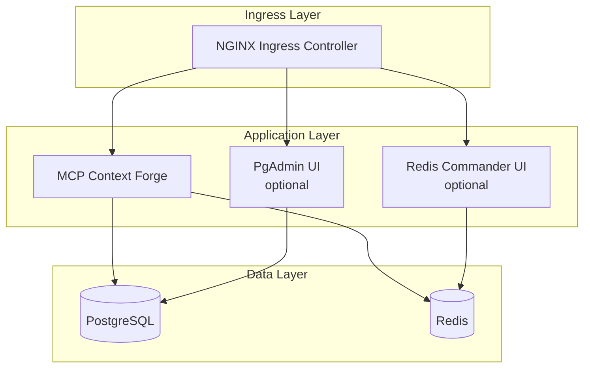

# 🚀 Deploying the MCP Gateway Stack with Helm

This guide walks you through installing, upgrading, and removing the full **MCP Gateway Stack** using Helm. The stack includes:

* 🧠 MCP Context Forge (the gateway)
* 🗄 PostgreSQL database
* ⚡ Redis cache
* 🧑💻 PgAdmin UI (optional)
* 🧰 Redis Commander UI (optional)

Everything is deployable via Helm on any Kubernetes cluster (Minikube, kind, EKS, AKS, GKE, OpenShift, etc.).

> 📦 Helm chart location:
> [https://github.com/IBM/mcp-context-forge/tree/main/charts/mcp-stack](https://github.com/IBM/mcp-context-forge/tree/main/charts/mcp-stack)

---

## 🧭 Architecture



## 📋 Prerequisites

| Requirement        | Notes                                                        |
| ------------------ | ------------------------------------------------------------ |
| Kubernetes ≥ 1.23  | Local (Minikube/kind) or managed (EKS, AKS, GKE, etc.)       |
| Helm 3             | Used for installing and managing releases                    |
| kubectl            | Configured to talk to your target cluster                    |
| Ingress Controller | NGINX, Traefik, or cloud-native (or disable via values.yaml) |
| StorageClass (RWX) | Required for PostgreSQL PVC unless persistence is disabled   |


???+ success "✅ Pre-flight Checklist (Run Before Deploying)"

    Ensure these checks pass before installing the stack.

    === "What cluster am I connected to?"

        ```bash
        kubectl config current-context
        kubectl cluster-info
        ```

        Verify you're pointing to the intended cluster context.

    === "Do I have the right permissions?"

        ```bash
        kubectl auth can-i create namespace
        kubectl auth can-i create deployment -n default
        kubectl auth can-i create clusterrolebinding
        ```

        Confirm you have adequate access (or switch to a namespace where you do).

    === "Is my Kubernetes version compatible?"

        ```bash
        kubectl version -o json | jq -r '.serverVersion.gitVersion'
        ```

        Must be `v1.23` or higher. Some Helm charts and features depend on it.

    === "Is a StorageClass with RWX access available?"

        ```bash
        kubectl get sc
        ```

        Required for persistent volumes (e.g., PostgreSQL).

    === "Is an Ingress controller installed?"

        ```bash
        kubectl get pods -A | grep -E 'ingress|traefik|nginx' || echo "No ingress controller found"
        ```

        If not, deploy one or disable ingress in `values.yaml`.

---

???+ info "🛠 Install Helm & kubectl"

    You'll need both Helm and kubectl installed to deploy the stack.

    === "macOS"

        ```bash
        brew install helm kubernetes-cli
        ```

        Uses Homebrew to install both tools in one step.

    === "Linux"

        ```bash
        # Helm
        curl -fsSL https://raw.githubusercontent.com/helm/helm/main/scripts/get-helm-3 | bash

        # kubectl
        curl -LO "https://dl.k8s.io/release/$(curl -sSL https://dl.k8s.io/release/stable.txt)/bin/linux/amd64/kubectl"
        chmod +x kubectl
        sudo mv kubectl /usr/local/bin
        ```

        Installs latest stable versions directly from official sources.

    === "Windows (PowerShell)"

        ```powershell
        choco install -y kubernetes-helm kubernetes-cli
        ```

        Requires [Chocolatey](https://chocolatey.org/install) to be installed first.

    === "Verify installation"

        ```bash
        helm version
        kubectl version
        kubectl config get-contexts
        ```

        Confirm both tools are installed and kubectl is configured for your cluster.

???+ info "📦 Clone and inspect the chart"

    ```bash
    git clone https://github.com/IBM/mcp-context-forge.git
    cd mcp-context-forge/charts/mcp-stack
    helm lint .
    ```

---

???+ check "✅ RBAC test (if enabled)"

    Confirm the service account created by the chart can access resources as expected.

    === "Test using impersonation"

        ```bash
        kubectl auth can-i list pods \
          --as=system:serviceaccount:mcp-private:mcp-stack-sa \
          -n mcp-private
        ```

    === "If denied, check RBAC status"

        ```bash
        kubectl get role,rolebinding -n mcp-private
        kubectl describe role mcp-stack-role -n mcp-private
        ```
---

???+ tip "🔐 Prepare the Namespace (Recommended)"

    It's best practice to isolate the stack in its own namespace, with labels and policies for security and clarity.

    === "Create the namespace"

        ```bash
        kubectl create namespace mcp-private --dry-run=client -o yaml | kubectl apply -f -
        ```

        You can use a different name (e.g. `mcp`, `prod-gateway`) as long as you reference it consistently in your Helm commands.

    === "Add environment labels and annotations"

        ```bash
        kubectl label namespace mcp-private environment=prod --overwrite
        kubectl annotate namespace mcp-private "config.kubernetes.io/owner=mcp" --overwrite
        ```

        Labels and annotations can help with GitOps sync, audit, and tracking tools.

    === "Optional: Apply default-deny NetworkPolicy"

        ```bash
        cat <<'EOF' | kubectl apply -n mcp-private -f -
        apiVersion: networking.k8s.io/v1
        kind: NetworkPolicy
        metadata:
          name: deny-by-default
        spec:
          podSelector: {}
          policyTypes: [Ingress, Egress]
        EOF
        ```

        This restricts all traffic by default. You'll need to define allowed communication between components separately, or use service mesh policies.

    === "Verify the namespace is ready"

        ```bash
        kubectl get ns mcp-private
        kubectl get networkpolicy -n mcp-private
        kubectl get sa default -n mcp-private -o yaml
        ```

        Confirm that the namespace exists and basic policies are in place.


## 🧾 Customize values

???+ info "🧾 Customize values.yaml"

    Copy and edit the default values file to tailor the deployment to your environment.

    === "Clone and copy the values file"

        ```bash
        cp values.yaml my-values.yaml
        ```

        This gives you a working copy of the Helm chart and lets you customize settings safely.

    === "Edit values for your environment"

        ```yaml
        mcpContextForge:
          image:
            repository: ghcr.io/ibm/mcp-context-forge
            tag: v1.0.0
          ingress:
            enabled: true
            host: gateway.local        # Change this to your actual DNS
            className: nginx

          envFrom:

            - secretRef:
                name: mcp-gateway-secret

            - configMapRef:
                name: mcp-gateway-config

        postgres:
          credentials:
            user: admin
            password: S3cuReP@ss       # Avoid hardcoding in production
          persistence:
            size: 10Gi

        pgadmin:
          enabled: false

        redisCommander:
          enabled: false

        rbac:
          create: true
        ```

        This configures image version, ingress host, secrets, storage, and RBAC. In production, prefer secrets over inline passwords.

    === "Validate the chart after customizing"

        ```bash
        helm lint .
        ```

        Ensures the chart is valid and ready to install.


---

## 🚀 Install / Upgrade the stack

???+ info "🚀 Install or Upgrade the Stack"

    Install the MCP Gateway Stack into your Kubernetes cluster using Helm. This will deploy all components defined in your `my-values.yaml`.

    === "Install for the first time"

        ```bash
        helm upgrade --install mcp-stack . \
          --namespace mcp-private \
          --create-namespace=false \
          -f my-values.yaml \
          --wait --timeout 30m --debug
        ```

        This installs or upgrades the stack in the `mcp-private` namespace, using your custom values file. Set `--create-namespace=true` if the namespace hasn't been created yet.

    === "What does this deploy?"

        - MCP Context Forge (API Gateway)
        - PostgreSQL with optional persistence
        - Redis cache
        - (Optional) PgAdmin & Redis Commander
        - Ingress configuration (if enabled)
        - NetworkPolicy and RBAC (if configured)

    === "Need to re-run install?"

        Helm upgrades are idempotent. You can run the same command again safely after making changes to `my-values.yaml`.


---

## ✅ Verify deployment

???+ success "✅ Verify Deployment"

    After installation completes, confirm that all resources are running and healthy.

    === "Check all resources in the namespace"

        ```bash
        kubectl get all -n mcp-private
        helm status mcp-stack -n mcp-private
        ```

        This should show running pods, services, deployments, and Helm release status.

    === "Verify Ingress (if enabled)"

        ```bash
        kubectl get ingress -n mcp-private
        curl http://gateway.local/health
        ```

        You should see a `200 OK` response or similar from the health endpoint.

    === "If not using Ingress: port forward"

        ```bash
        kubectl port-forward svc/mcp-stack-app 8080:80 -n mcp-private
        curl http://localhost:8080/health
        ```

        Port-forwarding gives you local access to the service when Ingress is disabled or not ready.

    === "Check logs and pod status (optional)"

        ```bash
        kubectl logs -n mcp-private deploy/mcp-stack-app --tail=50
        kubectl describe pod -l app.kubernetes.io/instance=mcp-stack -n mcp-private
        ```

        Useful for debugging if components are not responding or entering `CrashLoopBackOff`.


---

## 🔄 Upgrade & Rollback

???+ info "🔄 Upgrade & Rollback"

    You can upgrade to a new image version, preview changes before applying, or roll back to a previous release.

    === "Upgrade to a new image version"

        ```bash
        helm upgrade mcp-stack . -n mcp-private \
          --set mcpContextForge.image.tag=v1.2.3 \
          --wait
        ```

        Updates only the image tag (or any specific value you override) while preserving existing resources.

    === "Preview changes before upgrading"

        ```bash
        helm plugin install https://github.com/databus23/helm-diff
        helm diff upgrade mcp-stack . -n mcp-private -f my-values.yaml
        ```

        Shows what will change without applying anything. Requires the [helm-diff plugin](https://github.com/databus23/helm-diff).

    === "Roll back to a previous revision"

        ```bash
        helm rollback mcp-stack 1 -n mcp-private
        ```

        Use `helm history mcp-stack -n mcp-private` to list available revisions before rolling back.

---

## 🧹 Uninstall

???+ danger "🧹 Uninstall the Stack"

    This removes all components deployed by the Helm chart.

    === "Basic uninstall"

        ```bash
        helm uninstall mcp-stack -n mcp-private
        ```

        Removes deployments, services, and related resources created by the chart.

    === "Delete the namespace (optional)"

        ```bash
        kubectl delete namespace mcp-private
        ```

        Use this if you want to fully clean up everything, including secrets, configmaps, and PVCs.

    === "Full reset workflow"

        ```bash
        # Uninstall the Helm release
        helm uninstall mcp-stack -n mcp-private

        # Delete PVCs if you're not keeping data
        kubectl delete pvc --all -n mcp-private

        # Delete the namespace
        kubectl delete namespace mcp-private

        # Reinstall from scratch (if desired)
        helm upgrade --install mcp-stack . \
          --namespace mcp-private \
          -f my-values.yaml \
          --wait --timeout 15m --debug
        ```

        Use this flow when you need to wipe the environment and redeploy fresh.

---

## 🧪 CI/CD: Packaging & OCI Push

???+ info "🧪 CI/CD: Packaging & OCI Push"

    Package your Helm chart and push it to an OCI-compliant registry for use in GitOps workflows (e.g., Argo CD, Flux).

    === "Lint and package the chart"

        ```bash
        helm lint .
        helm package . -d dist/
        ```

        This validates your chart and creates a `.tgz` package in the `dist/` directory.

    === "Push to OCI registry"

        ```bash
        helm push dist/mcp-stack-*.tgz oci://ghcr.io/<your-org>/charts
        ```

        Replace `<your-org>` with your GitHub container registry org.
        Make sure `HELM_EXPERIMENTAL_OCI=1` is set if using older Helm versions.

    === "Why use OCI?"

        - Works with private registries
        - Easily versioned and managed
        - Supported by Argo CD and Flux natively

    === "Example: using in GitOps"

        Reference the chart by OCI URL in your GitOps tool:

        ```
        oci://ghcr.io/your-org/charts/mcp-stack
        ```

        Then sync as usual using your preferred tool.

---

## 🧯 Troubleshooting

???+ bug "🧯 Troubleshooting Common Issues"

    Quick fixes and diagnostic tips for common deployment problems.

    === "`ImagePullBackOff`"

        - **Cause**: Image not found or access denied
        - **Fix**:
          ```bash
          kubectl describe pod -n mcp-private
          ```
          - Check `image:` field in `values.yaml`
          - Ensure the image tag exists and is publicly accessible (or add a pull secret)

    === "`Ingress returns 404` or no external IP"

        - **Cause**: Ingress host mismatch or controller not ready
        - **Fix**:
          ```bash
          kubectl get ingress -n mcp-private
          kubectl get svc -A | grep ingress
          ```
          - Make sure the ingress hostname matches DNS or `/etc/hosts`
          - Confirm an Ingress Controller is deployed and available

    === "`CrashLoopBackOff` on a pod"

        - **Fix**:
          ```bash
          kubectl logs -n mcp-private <pod-name>
          kubectl describe pod <pod-name> -n mcp-private
          ```

          Check logs for configuration or secret injection issues.

        - **Startup Resilience**: If the pod is restarting due to database/Redis unavailability, the Gateway uses exponential backoff with jitter (default 30 retries ≈ 5 minutes). Configure via `DB_MAX_RETRIES` and `REDIS_MAX_RETRIES`. See [Startup Resilience](../architecture/performance-architecture.md#startup-resilience).

    === "`Env vars missing` (e.g., JWT_SECRET_KEY)"

        - **Cause**: Secret or ConfigMap not mounted
        - **Fix**: Confirm `envFrom` is configured in your `my-values.yaml` and the resources exist:

          ```bash
          kubectl get secret mcp-gateway-secret -n mcp-private
          kubectl get configmap mcp-gateway-config -n mcp-private
          ```

        !!! info "Authentication Note"
            The Admin UI uses email/password authentication (`PLATFORM_ADMIN_EMAIL`/`PASSWORD`). Basic auth for API endpoints is disabled by default for security.

    === "`RBAC access denied`"

        - **Fix**: Ensure RBAC roles are created properly:
          ```bash
          kubectl get role,rolebinding -n mcp-private
          ```

          You can also enable auto-RBAC creation with:

          ```yaml
          rbac:
            create: true
          ```

---

## 🧾 values.yaml - Common Keys

???+ info "🧾 values.yaml - Common Keys Reference"

    Most frequently used keys in `values.yaml` and what they control.

    | Key                                           | Default     | Description                                      |
    |----------------------------------------------|-------------|--------------------------------------------------|
    | `mcpContextForge.image.tag`                  | `latest`    | Image version for MCP Context Forge              |
    | `mcpContextForge.ingress.enabled`            | `true`      | Enables ingress resource creation                |
    | `mcpContextForge.ingress.host`               | `gateway.local` | Hostname used in Ingress (change in production) |
    | `mcpContextForge.service.type`               | `ClusterIP` | Use `LoadBalancer` if running in cloud           |
    | `mcpContextForge.envFrom`                    | `[]`        | Allows mounting Secrets/ConfigMaps as env vars   |
    | `postgres.credentials.user`                  | `admin`     | Default DB username (use secret in prod)         |
    | `postgres.credentials.password`              | `test123`   | Default DB password (avoid hardcoding)           |
    | `postgres.persistence.enabled`               | `true`      | Enables persistent volume claim for PostgreSQL   |
    | `postgres.persistence.size`                  | `10Gi`      | Size of the PostgreSQL volume                    |
    | `pgadmin.enabled`                            | `false`     | Enable PgAdmin for DB UI                         |
    | `redisCommander.enabled`                     | `false`     | Enable Redis Commander for Redis UI              |
    | `rbac.create`                                | `true`      | Automatically create Role/RoleBinding            |

    📝 For all possible options, see the full [`values.yaml`](https://github.com/IBM/mcp-context-forge/blob/main/charts/mcp-stack/values.yaml) file in the chart repository.

See full annotations in `values.yaml`.

---

## 📚 Further Reading

???+ note "📚 Further Reading & References"

    Useful links to understand Helm, Kubernetes, and GitOps tools used with the MCP stack.

    === "Helm"

        - 📘 [Helm Documentation](https://helm.sh/docs/)
        - 🔧 [Helm Diff Plugin](https://github.com/databus23/helm-diff)
        - 📦 [Helm OCI Registry Docs](https://helm.sh/docs/topics/registries/)

    === "Kubernetes"

        - 📘 [Kubernetes Ingress](https://kubernetes.io/docs/concepts/services-networking/ingress/)
        - 💾 [Persistent Volumes](https://kubernetes.io/docs/concepts/storage/persistent-volumes/)
        - 🔐 [Kubernetes Secrets](https://kubernetes.io/docs/concepts/configuration/secret/)
        - 🔒 [Network Policies](https://kubernetes.io/docs/concepts/services-networking/network-policies/)

    === "GitOps Tools"

        - 🚀 [Argo CD](https://argo-cd.readthedocs.io/)
        - 🔁 [Flux](https://fluxcd.io/)

---

✅ You now have a production-ready Helm workflow for MCP Context Forge. It's CI-friendly, customizable, and tested across Kubernetes distributions.
