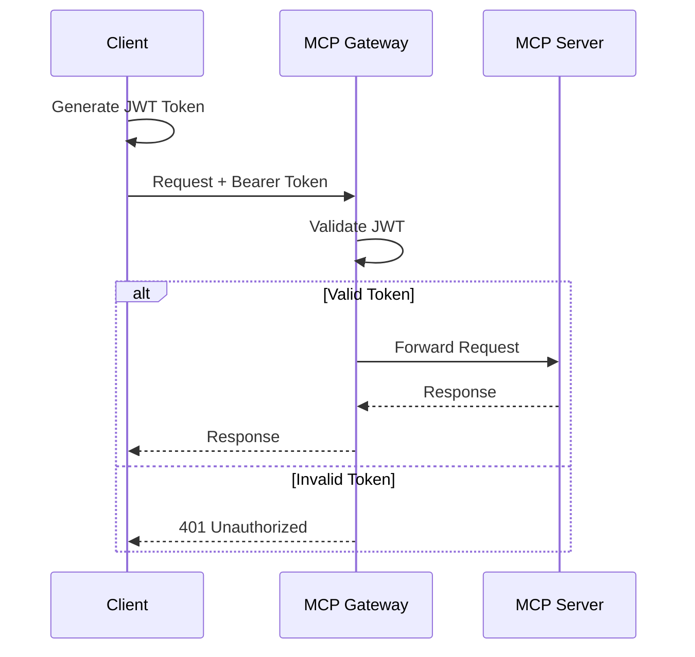
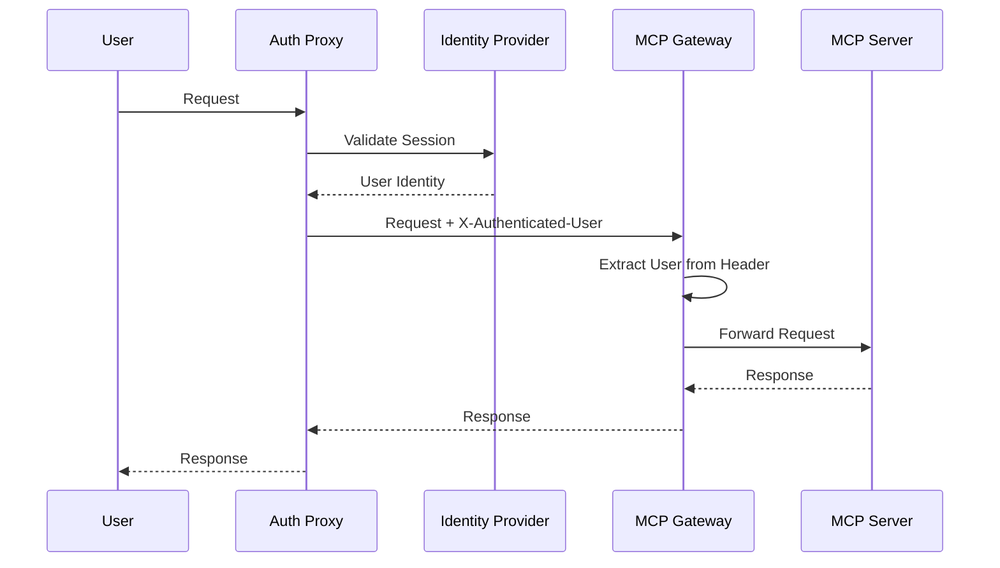
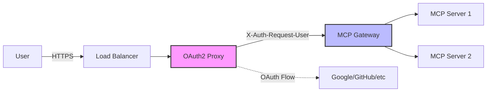
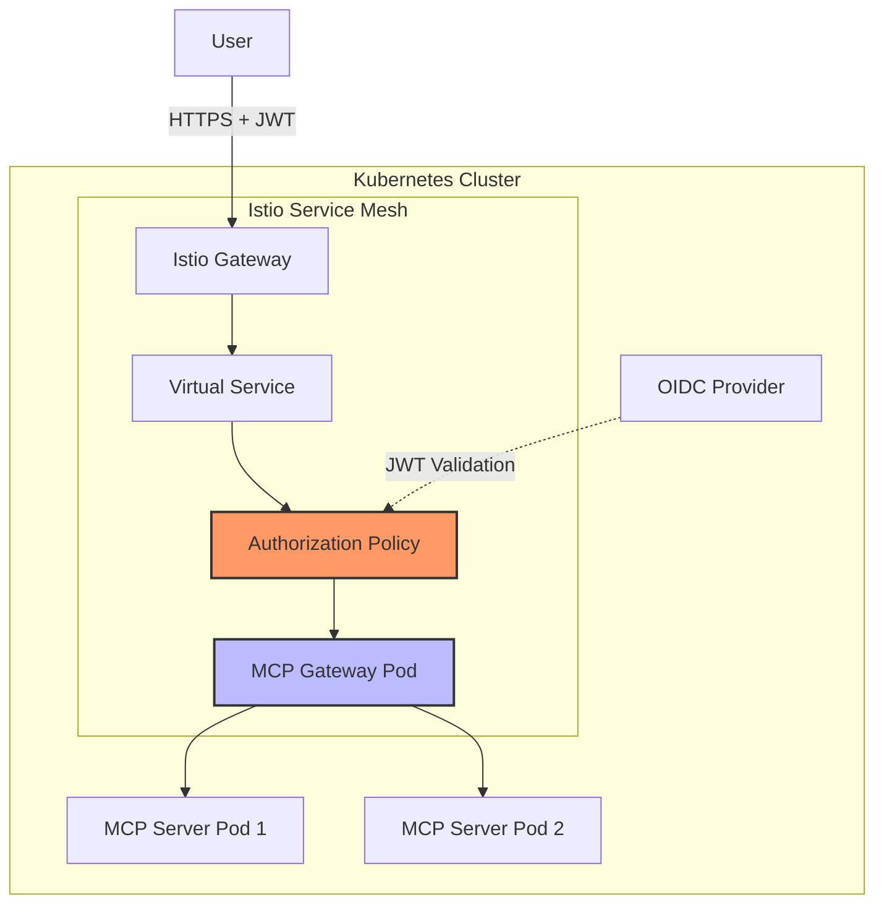
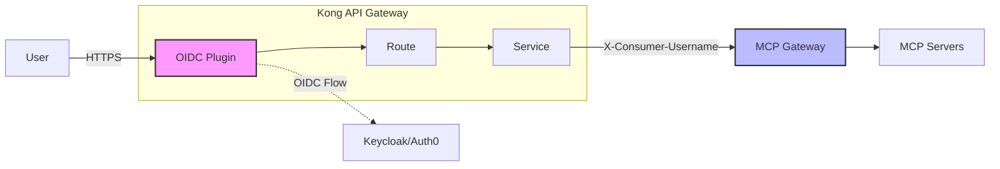
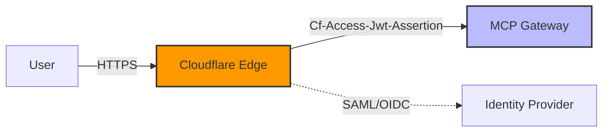
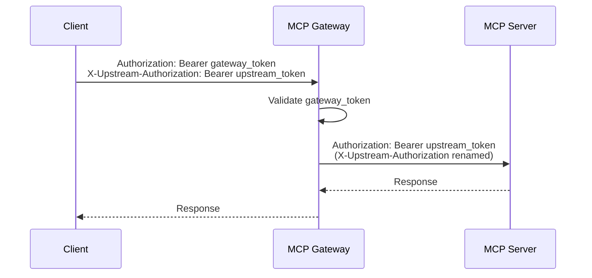
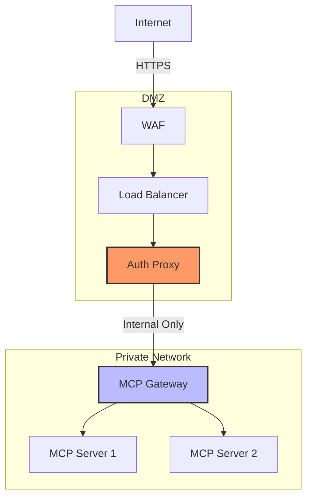
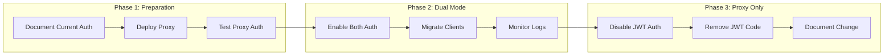
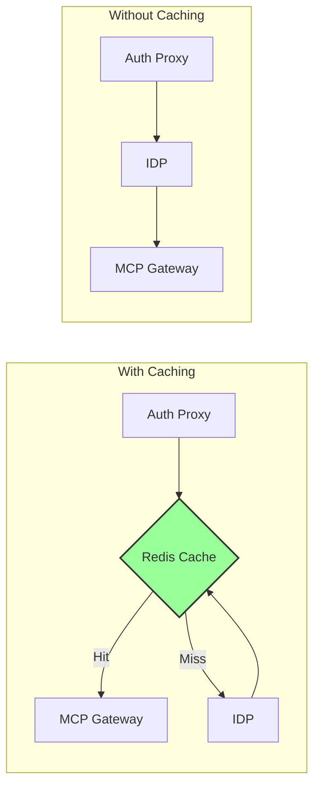

# Proxy Authentication

Configure MCP Gateway to work with authentication proxies for enterprise deployments.

## Overview

MCP Gateway supports proxy authentication, allowing you to disable built-in JWT authentication and rely on an upstream authentication proxy. This is essential for enterprise deployments where authentication is centralized through OAuth2, SAML, or other identity providers.

## Architecture

### Standard JWT Authentication Flow



### Proxy Authentication Flow



## Configuration

### Environment Variables

| Variable | Default | Description |
|----------|---------|-------------|
| `MCP_CLIENT_AUTH_ENABLED` | `true` | Enable/disable JWT authentication for MCP operations |
| `TRUST_PROXY_AUTH` | `false` | Trust proxy authentication headers (required when `MCP_CLIENT_AUTH_ENABLED=false`) |
| `PROXY_USER_HEADER` | `X-Authenticated-User` | Header containing authenticated username from proxy |
| `AUTH_REQUIRED` | `true` | Controls admin UI authentication (independent of MCP auth) |

!!! warning "Security Notice"
    Only set `MCP_CLIENT_AUTH_ENABLED=false` when MCP Gateway is deployed behind a trusted authentication proxy. Setting `TRUST_PROXY_AUTH=true` explicitly acknowledges this security requirement.

### Basic Configuration

```bash title=".env"
# Disable MCP client JWT authentication
MCP_CLIENT_AUTH_ENABLED=false

# Trust proxy authentication headers
TRUST_PROXY_AUTH=true

# Header containing authenticated user
PROXY_USER_HEADER=X-Authenticated-User

# Keep admin UI protected (uses email/password authentication)
AUTH_REQUIRED=true
PLATFORM_ADMIN_EMAIL=admin@example.com
PLATFORM_ADMIN_PASSWORD=secure-password
```

!!! info "Admin UI Authentication"
    The Admin UI uses email/password authentication (`PLATFORM_ADMIN_EMAIL`/`PLATFORM_ADMIN_PASSWORD`), not Basic auth. Basic authentication for API endpoints is disabled by default for security.

## Deployment Patterns

### Pattern 1: OAuth2 Proxy



#### Docker Compose Example

```yaml title="docker-compose.yml"
version: '3.8'

services:
  oauth2-proxy:
    image: quay.io/oauth2-proxy/oauth2-proxy:v7.5.0
    command:

      - --http-address=0.0.0.0:4180
      - --upstream=http://mcp-gateway:4444
      - --email-domain=*
      - --pass-user-headers=true
      - --set-xauthrequest=true
      - --skip-provider-button=true
    environment:
      OAUTH2_PROXY_CLIENT_ID: ${OAUTH_CLIENT_ID}
      OAUTH2_PROXY_CLIENT_SECRET: ${OAUTH_CLIENT_SECRET}
      OAUTH2_PROXY_COOKIE_SECRET: ${COOKIE_SECRET}
      OAUTH2_PROXY_PROVIDER: google
    ports:

      - "4180:4180"
    networks:

      - mcp-network

  mcp-gateway:
    image: ghcr.io/contingentai/mcp-gateway:latest
    environment:
      MCP_CLIENT_AUTH_ENABLED: "false"
      TRUST_PROXY_AUTH: "true"
      PROXY_USER_HEADER: "X-Auth-Request-Email"
      AUTH_REQUIRED: "true"
      BASIC_AUTH_USER: ${ADMIN_USER}
      BASIC_AUTH_PASSWORD: ${ADMIN_PASSWORD}
      DATABASE_URL: postgresql+psycopg://postgres:password@db:5432/mcp
    depends_on:

      - db
    networks:

      - mcp-network

  db:
    image: postgres:15
    environment:
      POSTGRES_DB: mcp
      POSTGRES_USER: postgres
      POSTGRES_PASSWORD: password
    volumes:

      - postgres_data:/var/lib/postgresql/data
    networks:

      - mcp-network

networks:
  mcp-network:
    driver: bridge

volumes:
  postgres_data:
```

### Pattern 2: Kubernetes with Istio



#### Kubernetes Manifests

```yaml title="mcp-gateway-deployment.yaml"
apiVersion: apps/v1
kind: Deployment
metadata:
  name: mcp-gateway
  namespace: mcp-system
spec:
  replicas: 3
  selector:
    matchLabels:
      app: mcp-gateway
  template:
    metadata:
      labels:
        app: mcp-gateway
        version: v1
    spec:
      containers:

      - name: mcp-gateway
        image: ghcr.io/contingentai/mcp-gateway:latest
        env:

        - name: MCP_CLIENT_AUTH_ENABLED
          value: "false"

        - name: TRUST_PROXY_AUTH
          value: "true"

        - name: PROXY_USER_HEADER
          value: "X-User-Id"

        - name: DATABASE_URL
          valueFrom:
            secretKeyRef:
              name: mcp-gateway-secrets
              key: database-url
        ports:

        - containerPort: 4444
          name: http
        livenessProbe:
          httpGet:
            path: /health
            port: http
          initialDelaySeconds: 30
          periodSeconds: 10
        readinessProbe:
          httpGet:
            path: /ready
            port: http
          initialDelaySeconds: 5
          periodSeconds: 5
```

```yaml title="istio-authorization.yaml"
apiVersion: security.istio.io/v1beta1
kind: RequestAuthentication
metadata:
  name: mcp-gateway-jwt
  namespace: mcp-system
spec:
  selector:
    matchLabels:
      app: mcp-gateway
  jwtRules:

  - issuer: "https://accounts.google.com"
    jwksUri: "https://www.googleapis.com/oauth2/v3/certs"
    outputPayloadToHeader: "X-User-Id"
---
apiVersion: security.istio.io/v1beta1
kind: AuthorizationPolicy
metadata:
  name: mcp-gateway-authz
  namespace: mcp-system
spec:
  selector:
    matchLabels:
      app: mcp-gateway
  action: ALLOW
  rules:

  - from:
    - source:
        requestPrincipals: ["*"]
```

### Pattern 3: API Gateway (Kong)



#### Kong Configuration

```yaml title="kong-config.yaml"
services:

  - name: mcp-gateway
    url: http://mcp-gateway:4444
    routes:

      - name: mcp-route
        paths:

          - /mcp
    plugins:

      - name: oidc
        config:
          client_id: mcp-client
          client_secret: ${OIDC_SECRET}
          discovery: https://auth.example.com/.well-known/openid-configuration
          introspection_endpoint: https://auth.example.com/introspect
          bearer_only: "yes"
          realm: mcp-gateway
          header_names:

            - X-Consumer-Username:preferred_username
            - X-Consumer-Id:sub
```

## Common Proxy Configurations

### Authelia

```yaml title="authelia-config.yml"
authentication_backend:
  ldap:
    url: ldaps://ldap.example.com
    base_dn: dc=example,dc=com

access_control:
  default_policy: deny
  rules:

    - domain: mcp.example.com
      policy: two_factor
      subject:

        - group:mcp-users

# Headers forwarded to backend
authorization:
  headers:
    Remote-User: username
    Remote-Email: email
    Remote-Groups: groups
```

MCP Gateway configuration:
```bash
MCP_CLIENT_AUTH_ENABLED=false
TRUST_PROXY_AUTH=true
PROXY_USER_HEADER=Remote-User
```

### Cloudflare Access



Configuration:
```bash
MCP_CLIENT_AUTH_ENABLED=false
TRUST_PROXY_AUTH=true
PROXY_USER_HEADER=Cf-Access-Authenticated-User-Email
```

### AWS ALB with Cognito

```bash
MCP_CLIENT_AUTH_ENABLED=false
TRUST_PROXY_AUTH=true
PROXY_USER_HEADER=X-Amzn-Oidc-Identity
```

## Header Passthrough

When using proxy authentication, you often need to pass additional headers to downstream MCP servers:

```bash
# Enable header passthrough
ENABLE_HEADER_PASSTHROUGH=true

# Optional: Enable overwriting of base headers (advanced usage)
ENABLE_OVERWRITE_BASE_HEADERS=false

# Headers to pass through (JSON array)
DEFAULT_PASSTHROUGH_HEADERS='["X-Tenant-Id", "X-Request-Id", "X-Authenticated-User", "X-Groups"]'
```

### X-Upstream-Authorization Header

When MCP Gateway uses authentication (JWT/Bearer/Basic/OAuth), clients face an Authorization header conflict when trying to pass different auth to upstream MCP servers.

**Problem**: You need one `Authorization` header for gateway auth and a different one for upstream MCP servers.

**Solution**: Use the `X-Upstream-Authorization` header, which the gateway automatically renames to `Authorization` when forwarding to upstream servers.



#### Example Usage

```bash
# Client authenticates to gateway with one token
# and passes different auth to upstream MCP server
curl -H "Authorization: Bearer $GATEWAY_JWT" \
     -H "X-Upstream-Authorization: Bearer $MCP_SERVER_TOKEN" \
     -X POST http://localhost:4444/tools/invoke/github_create_issue \
     -d '{"arguments": {"title": "New Issue"}}'
```

#### Configuration

This feature is automatically enabled when the gateway uses authentication:

```bash
# Any of these auth methods enable X-Upstream-Authorization handling
AUTH_REQUIRED=true
BASIC_AUTH_USER=admin
JWT_SECRET_KEY=your-secret

# Or OAuth-enabled gateways
# oauth_config in gateway configuration
```

The gateway will always process `X-Upstream-Authorization` headers when:

1. The gateway itself uses authentication (`auth_type` in ["basic", "bearer", "oauth"])
2. The header value passes security validation

**Note**: `X-Upstream-Authorization` processing is independent of the `ENABLE_HEADER_PASSTHROUGH` flag and always works when the gateway uses authentication.

#### Security Notes

- Headers are sanitized before forwarding
- Only processed when gateway authentication is enabled
- Failed sanitization logs warnings but doesn't block requests
- Provides clean separation between gateway and upstream authentication

## Security Considerations

### Network Isolation



!!! danger "Critical Security Requirements"

    1. **Never expose MCP Gateway directly** to the internet when proxy auth is enabled
    2. **Use TLS** for all communication between proxy and gateway
    3. **Implement network policies** to ensure only the proxy can reach the gateway
    4. **Validate proxy certificates** in production environments
    5. **Monitor authentication logs** for suspicious activity

### Recommended Security Headers

Configure your proxy to add these security headers:

```nginx title="nginx.conf"
# Security headers
add_header X-Frame-Options "DENY" always;
add_header X-Content-Type-Options "nosniff" always;
add_header X-XSS-Protection "1; mode=block" always;
add_header Referrer-Policy "strict-origin-when-cross-origin" always;
add_header Content-Security-Policy "default-src 'self'" always;

# Remove sensitive headers
proxy_hide_header X-Powered-By;
proxy_hide_header Server;

# Pass authentication headers
proxy_set_header X-Authenticated-User $remote_user;
proxy_set_header X-Real-IP $remote_addr;
proxy_set_header X-Forwarded-For $proxy_add_x_forwarded_for;
proxy_set_header X-Forwarded-Proto $scheme;
```

## Testing

### Verify Configuration

```bash
# Test without authentication (should fail or return anonymous)
curl -v http://localhost:4444/tools

# Test with proxy header
curl -H "X-Authenticated-User: john.doe@example.com" \
     http://localhost:4444/tools

# Test WebSocket with proxy header
wscat -c ws://localhost:4444/ws \
      -H "X-Authenticated-User: john.doe@example.com"
```

### Health Checks

Configure your load balancer to use these endpoints:

| Endpoint | Purpose | Expected Response |
|----------|---------|-------------------|
| `/health` | Liveness probe | 200 OK |
| `/ready` | Readiness probe | 200 OK when ready |
| `/metrics` | Prometheus metrics | Metrics in text format |

## Troubleshooting

### Common Issues

??? question "Getting 401 Unauthorized with proxy headers"
    **Check these settings:**

    1. Verify `MCP_CLIENT_AUTH_ENABLED=false`
    2. Ensure `TRUST_PROXY_AUTH=true`
    3. Confirm header name matches `PROXY_USER_HEADER`
    4. Check proxy is sending the header:
    ```bash
    # Debug headers being received
    curl -H "X-Authenticated-User: test" \
         http://localhost:4444/version -v
    ```

??? question "Warning: MCP auth disabled without trust"
    **You're seeing:**
    ```
    WARNING - MCP client authentication is disabled but trust_proxy_auth is not set
    ```

    **Solution:** Set `TRUST_PROXY_AUTH=true` to acknowledge proxy authentication.

??? question "WebSocket connections fail"
    **Common causes:**

    1. Proxy not passing headers on WebSocket upgrade
    2. Missing WebSocket support in proxy

    **nginx fix:**
    ```nginx
    location /ws {
        proxy_pass http://mcp-gateway:4444;
        proxy_http_version 1.1;
        proxy_set_header Upgrade $http_upgrade;
        proxy_set_header Connection "upgrade";
        proxy_set_header X-Authenticated-User $remote_user;
    }
    ```

??? question "How to handle multiple authentication methods?"
    **Use virtual servers with different auth configs:**

    ```yaml
    # Server 1: Proxy auth
    - name: internal-server
      auth_mode: proxy
      proxy_header: X-Employee-Id

    # Server 2: JWT auth
    - name: external-server
      auth_mode: jwt
      jwt_audience: external-clients
    ```

## Migration Guide

### From JWT to Proxy Authentication



#### Step-by-Step Migration

=== "Step 1: Deploy Proxy"
    ```bash
    # Deploy auth proxy alongside existing setup
    docker-compose up -d oauth2-proxy

    # Test proxy authentication
    curl -H "Authorization: Bearer $TOKEN" \
         http://localhost:4180/health
    ```

=== "Step 2: Enable Dual Mode"
    ```bash
    # Keep JWT auth but allow proxy headers
    MCP_CLIENT_AUTH_ENABLED=true
    TRUST_PROXY_AUTH=true
    PROXY_USER_HEADER=X-Auth-Request-Email
    ```

=== "Step 3: Test Both Methods"
    ```bash
    # Test JWT (existing)
    curl -H "Authorization: Bearer $JWT_TOKEN" \
         http://localhost:4444/tools

    # Test proxy header (new)
    curl -H "X-Auth-Request-Email: user@example.com" \
         http://localhost:4444/tools
    ```

=== "Step 4: Switch to Proxy Only"
    ```bash
    # Disable JWT authentication
    MCP_CLIENT_AUTH_ENABLED=false
    TRUST_PROXY_AUTH=true

    # Restart gateway
    docker-compose restart mcp-gateway
    ```

## Performance Considerations

### Caching User Identity



Configure Redis caching for better performance:

```bash
# Enable Redis cache
CACHE_TYPE=redis
REDIS_URL=redis://localhost:6379/0

# Cache user sessions
SESSION_TTL=3600  # 1 hour
```

## Monitoring

### Key Metrics

| Metric | Description | Alert Threshold |
|--------|-------------|-----------------|
| `mcp_auth_failures_total` | Failed authentication attempts | > 10/min |
| `mcp_proxy_header_missing` | Requests without proxy header | > 5/min |
| `mcp_auth_latency_seconds` | Authentication processing time | > 1s p99 |

### Grafana Dashboard

```json title="grafana-dashboard.json"
{
  "dashboard": {
    "title": "MCP Gateway - Proxy Auth",
    "panels": [
      {
        "title": "Auth Success Rate",
        "targets": [{
          "expr": "rate(mcp_auth_success_total[5m]) / rate(mcp_auth_attempts_total[5m])"
        }]
      },
      {
        "title": "Users by Proxy Header",
        "targets": [{
          "expr": "count by (user) (mcp_authenticated_requests_total)"
        }]
      }
    ]
  }
}
```

## Best Practices

!!! tip "Production Checklist"

    - [ ] Network isolation between proxy and gateway
    - [ ] TLS encryption for all connections
    - [ ] Rate limiting at proxy level
    - [ ] Audit logging enabled
    - [ ] Monitoring and alerting configured
    - [ ] Backup authentication method available
    - [ ] Documentation updated
    - [ ] Security review completed

## Related Documentation

- [Authentication Overview](./securing.md)
- [Security Best Practices](../architecture/security-features.md)
- [Deployment Guide](../deployment/index.md)
- [Federation Setup](../architecture/index.md)
