# MCP Gateway Manual Acceptance Testing

Acceptance testing for MCP Gateway. Use these example steps to ensure a deploy MCP Gateway is working correctly in your environment.

```mermaid
graph TB
    subgraph "TESTER WORKSTATION"
        PIP[pip install mcp-contextforge-gateway]
        JWT[mcpgateway.utils.create_jwt_token<br/>Generates Bearer Token]
        WRAPPER[mcpgateway.wrapper<br/>stdio to HTTP bridge]
        VSC_SSE[VS Code with SSE/HTTP<br/>Direct connection]
        INSPECTOR[MCP Inspector]
        AGENTS[AI Agents<br/>LangChain / CrewAI]
        HEY[hey<br/>Performance Testing]

        PIP --> JWT
        JWT --> WRAPPER
        JWT --> VSC_SSE
        JWT --> AGENTS
    end

    subgraph "MCP GATEWAY"
        GATEWAY_ENTRY[ ]
        GW[MCP Gateway<br/>Remote: $GW_URL]
        GW_AUTH[Authentication<br/>Bearer Token]
        GW_FEDERATION[Federation Layer]
        GW_VIRTUAL[Virtual Servers]
        GW_RESOURCES[Resources]
        GW_PROMPTS[Prompts]
        GW_TOOLS[Tool Registry]

        GW --> GW_AUTH
        GW_AUTH --> GW_FEDERATION
        GW_FEDERATION --> GW_VIRTUAL
        GW_FEDERATION --> GW_TOOLS
        GW --> GW_RESOURCES
        GW --> GW_PROMPTS
    end

    subgraph "MCP SERVERS RUNTIME"
        RUNTIME_ENTRY[ ]
        TIME[time server<br/>Port: 8101]
        TIME_AUTH[time server auth<br/>Port: 8102]
        FAST_TIME[fast_time_server]
        GIT[git server<br/>Port: 8103]
        GITHUB[github]
        JIRA[jira]
        SERVICENOW[servicenow]
        PLAYWRIGHT[playwright]
        FIGMA[figma]
        MONDAY[monday.com]
        BOX[box]
    end

    %% Simulate full subgraph connection
    GATEWAY_ENTRY -->|↕ Full Runtime ↔ Gateway| RUNTIME_ENTRY

    %% Connections from Workstation to Gateway
    WRAPPER -.->|HTTP/JSON-RPC| GW
    VSC_SSE -.->|SSE/HTTP| GW_VIRTUAL
    INSPECTOR -.->|HTTP| GW
    AGENTS -.->|HTTP API| GW
    HEY -.->|Load Testing| GW

    %% Styling for dark theme visibility
    classDef workstation fill:#2196F3,stroke:#64B5F6,stroke-width:3px,color:#fff
    classDef gateway fill:#FF6B35,stroke:#FF8C61,stroke-width:4px,color:#fff
    classDef servers fill:#9C27B0,stroke:#BA68C8,stroke-width:3px,color:#fff
    classDef auth fill:#F44336,stroke:#EF5350,stroke-width:3px,color:#fff

    class PIP,JWT,WRAPPER,VSC_SSE,INSPECTOR,AGENTS,HEY workstation
    class GW,GW_FEDERATION,GW_VIRTUAL,GW_RESOURCES,GW_PROMPTS,GW_TOOLS,GATEWAY_ENTRY gateway
    class TIME,TIME_AUTH,FAST_TIME,GIT,GITHUB,JIRA,SERVICENOW,PLAYWRIGHT,FIGMA,MONDAY,BOX,RUNTIME_ENTRY servers
    class GW_AUTH,TIME_AUTH auth

```



## Test Environment Setup

| Feature | URL/Command | Actions | Expected Result | Status | Notes |
|---------|-------------|---------|-----------------|--------|-------|
| Set Gateway URL | `export GW_URL=http://localhost:4444` | Set base URL (can be remote) | Variable exported | ☐ | Change to your gateway URL if remote |
| Install Gateway Package | `pip install mcp-contextforge-gateway` | Install the gateway package for utilities | Successfully installed | ☐ | Needed for JWT token creation and wrapper testing |
| Generate JWT Token | `export MCPGATEWAY_BEARER_TOKEN=$(python3 -m mcpgateway.utils.create_jwt_token -u admin@example.com --secret my-test-key)` | Generate auth token using installed package | Token generated and exported | ☐ | Default expiry 10080 (7 days) |
| Verify Health | `curl -s $GW_URL/health` | GET request (no auth required) | `{"status":"ok"}` | ☐ | Basic connectivity check |
| Verify Ready | `curl -s $GW_URL/ready` | GET request (no auth required) | `{"ready":true,"database":"ok","redis":"ok"}` | ☐ | All subsystems ready |
| Test Auth Required | `curl -s $GW_URL/version` | GET without auth | `{"detail":"Not authenticated"}` | ☐ | Confirms auth is enforced |
| Test Auth Works | `curl -s -H "Authorization: Bearer $MCPGATEWAY_BEARER_TOKEN" $GW_URL/version \| jq '.app.name'` | GET with auth | `"MCP_Gateway"` | ☐ | JWT authentication working |

## Setting up MCP Servers for Testing

| Feature | URL/Command | Actions | Expected Result | Status | Notes |
|---------|-------------|---------|-----------------|--------|-------|
| Start Time Server (No Auth) | `python3 -m mcpgateway.translate --stdio "uvx mcp_server_time -- --local-timezone=Europe/Dublin" --expose-sse --port 8101` | Launch MCP time server without auth | Server running on port 8101 | ☐ | SSE at http://localhost:8101/sse |
| Start Time Server (Auth) | `python3 -m mcpgateway.translate --stdio "uvx mcp_server_time -- --local-timezone=Europe/Dublin" --expose-sse --port 8102` | Launch MCP time server with auth | Server running on port 8102 | ☐ | Add Authorization header when registering |
| Start Git Server | `python3 -m mcpgateway.translate --stdio "uvx mcp_server_git -- ." --expose-sse --port 8103` | Launch MCP git server | Server running on port 8103 | ☐ | Provides git operations |
| Verify Time Server Health | `curl http://localhost:8101/health` | Check server status | `{"status":"healthy","uptime_seconds":XXX}` | ☐ | No auth endpoint |
| Test Auth Server | `curl -H "Authorization: Bearer secret123" http://localhost:8102/sse` | Test SSE with auth | SSE stream starts (Ctrl+C to exit) | ☐ | Confirms auth working |

## 1. Core Protocol Operations

| Feature | URL | Commands | Expected Result | Status | Notes |
|---------|-----|----------|-----------------|--------|-------|
| Protocol Initialize | `curl -X POST -H "Authorization: Bearer $MCPGATEWAY_BEARER_TOKEN" -H "Content-Type: application/json" -d '{"protocolVersion": "1.0.0", "capabilities": {"tools": {"listing": true, "execution": true}}, "clientInfo": {"name": "test-client", "version": "1.0.0"}}' $GW_URL/protocol/initialize` | Initialize MCP session | Returns server capabilities and info | ☐ | Establishes MCP session |
| Protocol Ping | `curl -X POST -H "Authorization: Bearer $MCPGATEWAY_BEARER_TOKEN" -H "Content-Type: application/json" -d '{"jsonrpc": "2.0", "id": "test-123", "method": "ping"}' $GW_URL/protocol/ping` | Send ping request | `{"jsonrpc": "2.0", "id": "test-123", "result": {}}` | ☐ | Keep-alive mechanism |
| Client Initialized | `curl -X POST -H "Authorization: Bearer $MCPGATEWAY_BEARER_TOKEN" -H "Content-Type: application/json" -d '{"method": "notifications/initialized"}' $GW_URL/protocol/notifications` | Notify server ready | 200 OK | ☐ | Client ready notification |
| Request Cancelled | `curl -X POST -H "Authorization: Bearer $MCPGATEWAY_BEARER_TOKEN" -H "Content-Type: application/json" -d '{"method": "notifications/cancelled", "params": {"requestId": "req-123"}}' $GW_URL/protocol/notifications` | Cancel request | 200 OK | ☐ | Cancel pending request |

## 2. Gateway Federation

| Feature | URL | Commands | Expected Result | Status | Notes |
|---------|-----|----------|-----------------|--------|-------|
| Register No-Auth Gateway | `curl -X POST -H "Authorization: Bearer $MCPGATEWAY_BEARER_TOKEN" -H "Content-Type: application/json" -d '{"name":"time_server_noauth","url":"http://127.0.0.1:8101/sse","transport":"SSE"}' $GW_URL/gateways \| jq` | Register time server | Success (201), returns gateway with ID | ☐ | **Key setup step** |
| Register Auth Gateway | `curl -X POST -H "Authorization: Bearer $MCPGATEWAY_BEARER_TOKEN" -H "Content-Type: application/json" -d '{"name":"time_server_auth","url":"http://127.0.0.1:8102/sse","transport":"SSE","auth_type":"bearer","auth_token":"secret123"}' $GW_URL/gateways \| jq` | Register with auth | Success (201) | ☐ | Gateway with authentication |
| Register Git Gateway | `curl -X POST -H "Authorization: Bearer $MCPGATEWAY_BEARER_TOKEN" -H "Content-Type: application/json" -d '{"name":"git_server","url":"http://127.0.0.1:8103/sse","transport":"SSE"}' $GW_URL/gateways \| jq` | Register git server | Success (201) | ☐ | Git operations gateway |
| List Gateways | `curl -H "Authorization: Bearer $MCPGATEWAY_BEARER_TOKEN" $GW_URL/gateways \| jq` | List all gateways | Shows all registered gateways with `"reachable": true` | ☐ | Verify federation status |
| Test Gateway Health | `curl -H "Authorization: Bearer $MCPGATEWAY_BEARER_TOKEN" $GW_URL/gateways/{gateway-id}/health \| jq` | Check specific gateway | Health status returned | ☐ | Monitor federation |

## 3. Tool Discovery & Execution

| Feature | URL | Commands | Expected Result | Status | Notes |
|---------|-----|----------|-----------------|--------|-------|
| List All Tools | `curl -sH "Authorization: Bearer $MCPGATEWAY_BEARER_TOKEN" $GW_URL/tools \| jq '.[].originalName'` | Discover federated tools | Shows: `"get_system_time"`, `"convert_time"`, `"git_log"`, etc. | ☐ | Tools from all gateways |
| Get Tool Details | `curl -H "Authorization: Bearer $MCPGATEWAY_BEARER_TOKEN" $GW_URL/tools/{tool-id} \| jq` | Get specific tool info | Full tool schema with inputSchema | ☐ | Replace {tool-id} with actual UUID |
| Execute Time Tool | `curl -X POST -H "Authorization: Bearer $MCPGATEWAY_BEARER_TOKEN" -H "Content-Type: application/json" -d '{"jsonrpc": "2.0", "method": "time-server-noauth-get-system-time", "params": {"timezone": "Europe/Dublin"}, "id": 1}' $GW_URL/rpc \| jq` | Call federated tool | Returns current Dublin time | ☐ | Cross-gateway execution |
| Convert Time Tool | `curl -X POST -H "Authorization: Bearer $MCPGATEWAY_BEARER_TOKEN" -H "Content-Type: application/json" -d '{"jsonrpc": "2.0", "method": "time-server-noauth-convert-time", "params": {"time": "2025-01-10T12:00:00Z", "source_timezone": "UTC", "target_timezone": "America/New_York"}, "id": 2}' $GW_URL/rpc \| jq` | Time conversion | Returns converted time | ☐ | Tool with multiple params |
| Execute Git Tool | `curl -X POST -H "Authorization: Bearer $MCPGATEWAY_BEARER_TOKEN" -H "Content-Type: application/json" -d '{"jsonrpc": "2.0", "method": "git-server-git-log", "params": {"repo_path": "."}, "id": 3}' $GW_URL/rpc \| jq` | Get git history | Returns git log entries | ☐ | File system tool |

## 4. Virtual Server Management

| Feature | URL | Commands | Expected Result | Status | Notes |
|---------|-----|----------|-----------------|--------|-------|
| Get Tool IDs | ```TIME_TOOL_ID=$(curl -s -H "Authorization: Bearer $MCPGATEWAY_BEARER_TOKEN" $GW_URL/tools \| jq -r '.[] \| select(.originalName=="get_system_time") \| .id'); echo $TIME_TOOL_ID``` | Extract tool UUID | Tool ID printed | ☐ | Save for server creation |
| Create Time Server | `curl -X POST -H "Authorization: Bearer $MCPGATEWAY_BEARER_TOKEN" -H "Content-Type: application/json" -d '{"name": "time_utilities", "description": "Time and timezone utilities", "associatedTools": ["'$TIME_TOOL_ID'"]}' $GW_URL/servers \| jq` | Create virtual server | Success (201), returns server UUID | ☐ | Groups related tools |
| List Servers | `curl -H "Authorization: Bearer $MCPGATEWAY_BEARER_TOKEN" $GW_URL/servers \| jq` | List all servers | Shows created virtual servers | ☐ | Verify server creation |
| Get Server UUID | `TIME_SERVER_UUID=$(curl -s -H "Authorization: Bearer $MCPGATEWAY_BEARER_TOKEN" $GW_URL/servers \| jq -r '.[] \| select(.name=="time_utilities") \| .id'); echo $TIME_SERVER_UUID` | Extract server UUID | Server ID printed | ☐ | For SSE endpoint |
| Test Server SSE | `curl -N -H "Authorization: Bearer $MCPGATEWAY_BEARER_TOKEN" "$GW_URL/servers/$TIME_SERVER_UUID/sse" --max-time 2` | Test SSE stream | SSE events start flowing | ☐ | Real-time updates |

## 5. Resource Management

| Feature | URL | Commands | Expected Result | Status | Notes |
|---------|-----|----------|-----------------|--------|-------|
| Create Markdown Resource | `curl -X POST -H "Authorization: Bearer $MCPGATEWAY_BEARER_TOKEN" -H "Content-Type: application/json" -d '{"uri": "docs/readme", "name": "readme", "description": "Project README", "mimeType": "text/markdown", "content": "# MCP Gateway\n\nWelcome to the MCP Gateway!"}' $GW_URL/resources \| jq` | Create README | Success (201) | ☐ | Markdown content |
| Create JSON Resource | `curl -X POST -H "Authorization: Bearer $MCPGATEWAY_BEARER_TOKEN" -H "Content-Type: application/json" -d '{"uri": "config/app", "name": "app_config", "mimeType": "application/json", "content": "{\"version\": \"1.0.0\", \"debug\": false}"}' $GW_URL/resources \| jq` | Create config | Success (201) | ☐ | JSON content |
| List Resources | `curl -H "Authorization: Bearer $MCPGATEWAY_BEARER_TOKEN" $GW_URL/resources \| jq` | List all resources | Shows created resources | ☐ | Verify creation |
| Get Resource Content | `curl -H "Authorization: Bearer $MCPGATEWAY_BEARER_TOKEN" $GW_URL/resources/{resource-id}/content` | Read resource | Returns actual content | ☐ | May use caching |

## 6. Prompt Management

| Feature | URL | Commands | Expected Result | Status | Notes |
|---------|-----|----------|-----------------|--------|-------|
| Create Analysis Prompt | `curl -X POST -H "Authorization: Bearer $MCPGATEWAY_BEARER_TOKEN" -H "Content-Type: application/json" -d '{"name": "code_analysis", "description": "Analyze code quality", "template": "Analyze the following {{ language }} code:\n\n{{ code }}\n\nFocus on: {{ focus_areas }}", "arguments": [{"name": "language", "description": "Programming language", "required": true}, {"name": "code", "description": "Code to analyze", "required": true}, {"name": "focus_areas", "description": "Specific areas to focus on", "required": false}]}' $GW_URL/prompts \| jq` | Create with args | Success (201) | ☐ | Template with variables |
| Create Simple Prompt | `curl -X POST -H "Authorization: Bearer $MCPGATEWAY_BEARER_TOKEN" -H "Content-Type: application/json" -d '{"name": "system_summary", "description": "System status summary", "template": "MCP Gateway is running and ready to process requests.", "arguments": []}' $GW_URL/prompts \| jq` | No arguments | Success (201) | ☐ | Static prompt |
| Execute Prompt | `curl -X POST -H "Authorization: Bearer $MCPGATEWAY_BEARER_TOKEN" -H "Content-Type: application/json" -d '{"name": "Alice", "company": "Acme Corp"}' $GW_URL/prompts/greeting_prompt \| jq` | Fill template | `{"messages":[{"role":"user","content":{"type":"text","text":"Hello Alice, welcome to Acme Corp!"}}]}` | ☐ | Dynamic generation |
| List Prompts | `curl -H "Authorization: Bearer $MCPGATEWAY_BEARER_TOKEN" $GW_URL/prompts \| jq` | List all prompts | Shows created prompts | ☐ | Verify creation |

## 7. REST Tool Creation

| Feature | URL | Commands | Expected Result | Status | Notes |
|---------|-----|----------|-----------------|--------|-------|
| Create REST Tool | `curl -X POST -H "Authorization: Bearer $MCPGATEWAY_BEARER_TOKEN" -H "Content-Type: application/json" -d '{"name": "weather_api", "url": "https://api.openweathermap.org/data/2.5/weather", "description": "Get current weather data", "integrationType": "REST", "requestType": "GET", "headers": {"X-API-Key": "demo-key"}, "input_schema": {"type": "object", "properties": {"q": {"type": "string", "description": "City name"}, "units": {"type": "string", "enum": ["metric", "imperial"]}}, "required": ["q"]}}' $GW_URL/tools \| jq` | Virtualize REST API | Success (201) | ☐ | REST as MCP tool |

## 8. MCP Wrapper Testing

| Feature | URL | Commands | Expected Result | Status | Notes |
|---------|-----|----------|-----------------|--------|-------|
| Install Package | `pip install mcp-contextforge-gateway` | Install for wrapper | Package installed | ☐ | If not already done |
| Set Environment | `export MCP_SERVER_URL="$GW_URL/servers/$TIME_SERVER_UUID" && export MCP_AUTH=$MCPGATEWAY_BEARER_TOKEN` | Configure wrapper | Environment set | ☐ | Point to virtual server |
| Test Wrapper Init | `echo '{"jsonrpc":"2.0","id":1,"method":"initialize","params":{"protocolVersion":"2025-03-26","capabilities":{},"clientInfo":{"name":"test","version":"1.0"}}}' \| python3 -m mcpgateway.wrapper 2>/dev/null \| jq` | Initialize via stdio | Returns capabilities with tools | ☐ | Stdio to HTTP bridge |
| List Tools via Wrapper | `echo '{"jsonrpc":"2.0","id":2,"method":"tools/list","params":{}}' \| python3 -m mcpgateway.wrapper 2>/dev/null \| jq` | List tools via stdio | Returns tool list | ☐ | Wrapper functionality |

## 9. VS Code Integration Testing

### 9.1. VS Code with MCP Wrapper (stdio)

| Feature | Configuration | Actions | Expected Result | Status | Notes |
|---------|--------------|---------|-----------------|--------|-------|
| Install VS Code Extension | Install "MCP Host" extension | Open VS Code, install from marketplace | Extension installed | ☐ | Official MCP extension |
| Configure MCP Settings | Add to VS Code settings.json | ```json
{
  "mcp.servers": {
    "gateway-virtual": {
      "command": "python",
      "args": ["-m", "mcpgateway.wrapper"],
      "env": {
        "MCP_SERVER_URL": "$GW_URL/servers/$TIME_SERVER_UUID",
        "MCP_AUTH": "$MCPGATEWAY_BEARER_TOKEN"
      }
    }
  }
}``` | Server configured | ☐ | Replace $GW_URL and tokens |
| Restart VS Code | Reload window | Cmd/Ctrl+Shift+P → "Reload Window" | MCP server connects | ☐ | Check output panel |
| Verify Connection | Check MCP panel | View → MCP Servers | Gateway tools visible | ☐ | Should show time tools |
| Execute Tool | Use command palette | Cmd/Ctrl+Shift+P → "MCP: Execute Tool" → Select time tool | Tool executes successfully | ☐ | Returns time data |

### 9.2. VS Code Direct SSE/HTTP Connection

| Feature | Configuration | Actions | Expected Result | Status | Notes |
|---------|--------------|---------|-----------------|--------|-------|
| Configure Direct SSE | Add to VS Code settings.json | ```json
{
  "mcp.servers": {
    "gateway-direct": {
      "transport": "sse",
      "url": "$GW_URL/servers/$TIME_SERVER_UUID/sse",
      "headers": {
        "Authorization": "Bearer $MCPGATEWAY_BEARER_TOKEN"
      }
    }
  }
}``` | Server configured | ☐ | Direct SSE connection |
| Test HTTP Transport | Alternative config | ```json
{
  "mcp.servers": {
    "gateway-http": {
      "transport": "http",
      "url": "$GW_URL",
      "headers": {
        "Authorization": "Bearer $MCPGATEWAY_BEARER_TOKEN"
      }
    }
  }
}``` | HTTP transport configured | ☐ | REST-based connection |
| Verify SSE Stream | Check developer tools | F12 → Network tab → Filter "EventSource" | SSE connection established | ☐ | Real-time updates |
| Execute via HTTP | Use MCP panel | Click tool → Enter parameters → Execute | Tool runs successfully | ☐ | Check response |

## 10. AI Agent Integration Testing

### 10.1. LangChain Integration

| Feature | Command | Actions | Expected Result | Status | Notes |
|---------|---------|---------|-----------------|--------|-------|
| Install LangChain MCP | `pip install langchain-mcp` | Install integration package | Package installed | ☐ | LangChain MCP support |
| Configure Agent | Create test script | langchain_test_1.py  | Agent configured | ☐ | Replace variables |
| Test Tool Discovery | Run: `print(len(tools))` | List available tools | Shows tool count > 0 | ☐ | Verify integration |
| Execute via Agent | `agent.run("What time is it in Dublin?")` | Natural language query | Returns Dublin time | ☐ | Tool execution through LLM |
| Complex Query | `agent.run("Convert 3pm UTC to Tokyo time")` | Multi-step reasoning | Correct conversion | ☐ | Tests tool chaining |

**langchain_test_1.py**

```python
from langchain_mcp import MCPToolkit
from langchain.agents import create_react_agent

toolkit = MCPToolkit(
    gateway_url="$GW_URL",
    auth_token="$MCPGATEWAY_BEARER_TOKEN"
)
tools = toolkit.get_tools()
agent = create_react_agent(tools=tools)
```

### 10.2. CrewAI Integration

| Feature | Command | Actions | Expected Result | Status | Notes |
|---------|---------|---------|-----------------|--------|-------|
| Install CrewAI | `pip install crewai crewai-tools` | Install CrewAI framework | Package installed | ☐ | Multi-agent framework |
| Configure MCP Tool | Create custom tool | `crewai_test_1.py` | Tool configured | ☐ | Wrap MCP tool |
| Create Agent | Define specialist agent | `crewai_test_2.py` | Crew executes | ☐ | Collaborative execution |
| Verify Results | Check output | Print crew execution results | Correct times returned | ☐ | Multi-agent coordination |

**crewai_test_1.py**

```python
from crewai_tools import MCPGatewayTool

time_tool = MCPGatewayTool(
    gateway_url="$GW_URL",
    tool_name="time-server-noauth-get-system-time",
    auth_token="$MCPGATEWAY_BEARER_TOKEN"
)
```

**crewai_test_2.py**
```python
from crewai import Agent

time_agent = Agent(
    role="Time Zone Specialist",
    goal="Provide accurate time information",
    tools=[time_tool]
)
```

**crewai_test_3.py**
```python
from crewai import Crew, Task

task = Task(description="Get current time in multiple cities")
crew = Crew(agents=[time_agent], tasks=[task])
result = crew.kickoff()
```

## 11. Open Source MCP Server Testing

| Server | Registration Command | Tool Discovery | Sample Execution | Status | Notes |
|--------|---------------------|----------------|------------------|--------|-------|
| GitHub | `curl -X POST -H "Authorization: Bearer $MCPGATEWAY_BEARER_TOKEN" -H "Content-Type: application/json" -d '{"name":"github","url":"http://localhost:3001/sse","transport":"SSE"}' $GW_URL/gateways \| jq` | `curl -H "Authorization: Bearer $MCPGATEWAY_BEARER_TOKEN" $GW_URL/tools \| jq '.[] \| select(.gatewaySlug=="github")'` | Create issue, list PRs | ☐ | Requires GitHub token |
| Jira | `curl -X POST -H "Authorization: Bearer $MCPGATEWAY_BEARER_TOKEN" -H "Content-Type: application/json" -d '{"name":"jira","url":"http://localhost:3002/sse","transport":"SSE","auth_type":"bearer","auth_token":"JIRA_API_KEY"}' $GW_URL/gateways \| jq` | Check for issue management tools | Create/update tickets | ☐ | Requires Jira instance |
| ServiceNow | `curl -X POST -H "Authorization: Bearer $MCPGATEWAY_BEARER_TOKEN" -H "Content-Type: application/json" -d '{"name":"servicenow","url":"http://localhost:3003/sse","transport":"SSE"}' $GW_URL/gateways \| jq` | Verify incident tools | Create incidents | ☐ | ITSM integration |
| Playwright | `curl -X POST -H "Authorization: Bearer $MCPGATEWAY_BEARER_TOKEN" -H "Content-Type: application/json" -d '{"name":"playwright","url":"http://localhost:3004/sse","transport":"SSE"}' $GW_URL/gateways \| jq` | Browser automation tools | Navigate, screenshot | ☐ | Web automation |
| Figma | `curl -X POST -H "Authorization: Bearer $MCPGATEWAY_BEARER_TOKEN" -H "Content-Type: application/json" -d '{"name":"figma","url":"http://localhost:3005/sse","transport":"SSE","auth_type":"bearer","auth_token":"FIGMA_TOKEN"}' $GW_URL/gateways \| jq` | Design tools | Export designs | ☐ | Requires Figma token |
| Monday.com | `curl -X POST -H "Authorization: Bearer $MCPGATEWAY_BEARER_TOKEN" -H "Content-Type: application/json" -d '{"name":"monday","url":"http://localhost:3006/sse","transport":"SSE"}' $GW_URL/gateways \| jq` | Project management tools | Create boards/items | ☐ | Work management |
| Box | `curl -X POST -H "Authorization: Bearer $MCPGATEWAY_BEARER_TOKEN" -H "Content-Type: application/json" -d '{"name":"box","url":"http://localhost:3007/sse","transport":"SSE","auth_type":"oauth2","auth_token":"BOX_TOKEN"}' $GW_URL/gateways \| jq` | File storage tools | Upload/download files | ☐ | Cloud storage |

### MCP Server Tool Testing

| Server | Tool Test Command | Expected Result | Status | Notes |
|--------|-------------------|-----------------|--------|-------|
| GitHub | `curl -X POST -H "Authorization: Bearer $MCPGATEWAY_BEARER_TOKEN" -H "Content-Type: application/json" -d '{"jsonrpc": "2.0", "method": "github-list-repositories", "params": {"org": "anthropics"}, "id": 1}' $GW_URL/rpc \| jq` | List of repositories | ☐ | Public repo access |
| Jira | `curl -X POST -H "Authorization: Bearer $MCPGATEWAY_BEARER_TOKEN" -H "Content-Type: application/json" -d '{"jsonrpc": "2.0", "method": "jira-search-issues", "params": {"jql": "project = TEST"}, "id": 1}' $GW_URL/rpc \| jq` | Issue list | ☐ | JQL query |
| ServiceNow | `curl -X POST -H "Authorization: Bearer $MCPGATEWAY_BEARER_TOKEN" -H "Content-Type: application/json" -d '{"jsonrpc": "2.0", "method": "servicenow-get-incidents", "params": {"limit": 5}, "id": 1}' $GW_URL/rpc \| jq` | Recent incidents | ☐ | ITSM data |
| Playwright | `curl -X POST -H "Authorization: Bearer $MCPGATEWAY_BEARER_TOKEN" -H "Content-Type: application/json" -d '{"jsonrpc": "2.0", "method": "playwright-screenshot", "params": {"url": "https://example.com"}, "id": 1}' $GW_URL/rpc \| jq` | Base64 screenshot | ☐ | Headless browser |
| Figma | `curl -X POST -H "Authorization: Bearer $MCPGATEWAY_BEARER_TOKEN" -H "Content-Type: application/json" -d '{"jsonrpc": "2.0", "method": "figma-get-file", "params": {"file_key": "TEST_FILE"}, "id": 1}' $GW_URL/rpc \| jq` | Design file data | ☐ | Design assets |
| Monday | `curl -X POST -H "Authorization: Bearer $MCPGATEWAY_BEARER_TOKEN" -H "Content-Type: application/json" -d '{"jsonrpc": "2.0", "method": "monday-list-boards", "params": {}, "id": 1}' $GW_URL/rpc \| jq` | Board list | ☐ | Workspace data |
| Box | `curl -X POST -H "Authorization: Bearer $MCPGATEWAY_BEARER_TOKEN" -H "Content-Type: application/json" -d '{"jsonrpc": "2.0", "method": "box-list-folders", "params": {"folder_id": "0"}, "id": 1}' $GW_URL/rpc \| jq` | Root folder contents | ☐ | File listing |

## 12. Health & Monitoring

| Feature | URL | Commands | Expected Result | Status | Notes |
|---------|-----|----------|-----------------|--------|-------|
| Version Info (JSON) | `curl -H "Authorization: Bearer $MCPGATEWAY_BEARER_TOKEN" $GW_URL/version \| jq` | Get diagnostics | Detailed system info including uptime, platform, database status | ☐ | **Key diagnostic endpoint** |
| Version Info (HTML) | `curl -H "Authorization: Bearer $MCPGATEWAY_BEARER_TOKEN" "$GW_URL/version?fmt=html"` | Human-readable | HTML diagnostics page | ☐ | Browser-friendly |
| OpenAPI Schema | `curl -H "Authorization: Bearer $MCPGATEWAY_BEARER_TOKEN" $GW_URL/openapi.json \| jq '.info.title'` | Get API schema | `"MCP_Gateway"` | ☐ | API documentation |
| Swagger UI | `curl -H "Authorization: Bearer $MCPGATEWAY_BEARER_TOKEN" $GW_URL/docs \| grep -q "MCP Gateway" && echo "✓ Swagger UI loads"` | Interactive docs | ✓ Swagger UI loads | ☐ | API explorer |
| ReDoc | `curl -H "Authorization: Bearer $MCPGATEWAY_BEARER_TOKEN" $GW_URL/redoc \| grep -q "ReDoc" && echo "✓ ReDoc loads"` | Alternative docs | ✓ ReDoc loads | ☐ | Clean API docs |

## 13. Admin Interface Testing

**Note**: Admin API must be enabled in configuration:
```bash
MCPGATEWAY_UI_ENABLED=true
MCPGATEWAY_ADMIN_API_ENABLED=true
```

| Feature | URL | Commands | Expected Result | Status | Notes |
|---------|-----|----------|-----------------|--------|-------|
| Admin Home | Navigate to `$GW_URL/admin` | Access admin UI | Dashboard displayed | ☐ | Visual interface |
| Create Tool (Form) | `curl -X POST $GW_URL/admin/tools -H "Authorization: Bearer $MCPGATEWAY_BEARER_TOKEN" -H "Content-Type: application/x-www-form-urlencoded" -d 'name=admin_tool&url=https://api.example.com/v1/endpoint&description=Admin created tool&integrationType=REST&requestType=GET'` | Create via form | `{"message": "Tool registered successfully!", "success": true}` | ☐ | Form submission |
| Create Resource (Form) | `curl -X POST $GW_URL/admin/resources -H "Authorization: Bearer $MCPGATEWAY_BEARER_TOKEN" -H "Content-Type: application/x-www-form-urlencoded" -d 'uri=admin/test&name=admin_resource&description=Created via admin&mimeType=text/plain&content=Admin content'` | Create via form | 303 redirect | ☐ | Admin form endpoint |
| Test Gateway Connectivity | `curl -X POST $GW_URL/admin/gateways/test -H "Authorization: Bearer $MCPGATEWAY_BEARER_TOKEN" -H "Content-Type: application/json" -d '{"base_url": "http://localhost:8101", "path": "/health", "method": "GET", "headers": {}, "body": null}'` | Test connection | Returns status_code, latency_ms, and body | ☐ | Connectivity test |

## 14. Input Validation Testing

| Feature | URL | Commands | Expected Result | Status | Notes |
|---------|-----|----------|-----------------|--------|-------|
| XSS in Tool Name | `curl -X POST $GW_URL/tools -H "Authorization: Bearer $MCPGATEWAY_BEARER_TOKEN" -H "Content-Type: application/json" -d '{"name": "<script>alert(1)</script>", "url": "https://example.com"}'` | Attempt XSS | 422 - `"Tool name must start with a letter, number, or underscore and contain only letters, numbers, periods, underscores, hyphens, and slashes"` | ☐ | Input sanitization |
| SQL Injection Pattern | `curl -X POST $GW_URL/admin/tools -H "Authorization: Bearer $MCPGATEWAY_BEARER_TOKEN" -H "Content-Type: application/x-www-form-urlencoded" -d 'name=tool"; DROP TABLE tools; --&url=https://example.com&integrationType=REST&requestType=GET'` | SQL injection | 400/500 - Validation error | ☐ | Pattern blocked |
| Invalid URL Scheme | `curl -X POST $GW_URL/tools -H "Authorization: Bearer $MCPGATEWAY_BEARER_TOKEN" -H "Content-Type: application/json" -d '{"name": "test_tool", "url": "javascript:alert(1)"}'` | JavaScript URL | 422 - `"Tool URL must start with one of: http://, https://, ws://, wss://"` | ☐ | URL validation |
| Directory Traversal | `curl -X POST $GW_URL/admin/resources -H "Authorization: Bearer $MCPGATEWAY_BEARER_TOKEN" -H "Content-Type: application/x-www-form-urlencoded" -d 'uri=../../etc/passwd&name=test&content=data'` | Path traversal | 500 - `"Resource URI cannot contain directory traversal sequences"` | ☐ | Path validation |
| Name Too Long | `curl -X POST $GW_URL/tools -H "Authorization: Bearer $MCPGATEWAY_BEARER_TOKEN" -H "Content-Type: application/json" -d '{"name": "'"$(printf 'a%.0s' {1..300})"'", "url": "https://example.com"}'` | 300 char name | 422 - `"Tool name exceeds maximum length of 255"` | ☐ | Length validation |
| Empty Required Field | `curl -X POST $GW_URL/tools -H "Authorization: Bearer $MCPGATEWAY_BEARER_TOKEN" -H "Content-Type: application/json" -d '{"name": "", "url": "https://example.com"}'` | Empty name | 422 - `"Tool name cannot be empty"` | ☐ | Required validation |
| Whitespace Only | `curl -X POST $GW_URL/tools -H "Authorization: Bearer $MCPGATEWAY_BEARER_TOKEN" -H "Content-Type: application/json" -d '{"name": "   ", "url": "https://example.com"}'` | Spaces only | 422 - `"Tool name cannot be empty"` | ☐ | Trimming validation |

## 15. Error Handling Verification

| Feature | URL | Commands | Expected Result | Status | Notes |
|---------|-----|----------|-----------------|--------|-------|
| Tool Not Found | `curl -H "Authorization: Bearer $MCPGATEWAY_BEARER_TOKEN" $GW_URL/tools/nonexistent \| jq '.detail'` | Get missing tool | `"Tool not found"` | ☐ | 404 response |
| Missing Required Fields | `curl -X POST $GW_URL/tools -H "Content-Type: application/json" -H "Authorization: Bearer $MCPGATEWAY_BEARER_TOKEN" -d '{}' \| jq '.detail[0].msg'` | Empty POST | `"Field required"` | ☐ | 422 validation |
| Invalid Endpoint | `curl -H "Authorization: Bearer $MCPGATEWAY_BEARER_TOKEN" $GW_URL/invalid-endpoint \| jq '.detail'` | Bad URL | `"Not Found"` | ☐ | 404 response |
| Invalid RPC Method | `curl -X POST $GW_URL/rpc -H "Authorization: Bearer $MCPGATEWAY_BEARER_TOKEN" -H "Content-Type: application/json" -d '{"jsonrpc": "2.0", "method": "invalid/method", "id": 1}' \| jq` | Bad method | Error response | ☐ | RPC error |

## 16. System Summary Verification

| Feature | URL | Commands | Expected Result | Status | Notes |
|---------|-----|----------|-----------------|--------|-------|
| Count All Entities | ```echo "=== System Status ==="; echo "Gateways: $(curl -s -H "Authorization: Bearer $MCPGATEWAY_BEARER_TOKEN" $GW_URL/gateways \| jq length)"; echo "Tools: $(curl -s -H "Authorization: Bearer $MCPGATEWAY_BEARER_TOKEN" $GW_URL/tools \| jq length)"; echo "Resources: $(curl -s -H "Authorization: Bearer $MCPGATEWAY_BEARER_TOKEN" $GW_URL/resources \| jq length)"; echo "Prompts: $(curl -s -H "Authorization: Bearer $MCPGATEWAY_BEARER_TOKEN" $GW_URL/prompts \| jq length)"; echo "Servers: $(curl -s -H "Authorization: Bearer $MCPGATEWAY_BEARER_TOKEN" $GW_URL/servers \| jq length)"``` | System overview | All counts > 0 | ☐ | Verify test data |

## Test Cleanup

| Feature | URL/Command | Actions | Expected Result | Status | Notes |
|---------|-------------|---------|-----------------|--------|-------|
| Stop Time Server (8101) | Ctrl+C on process | Terminate server | Process stopped | ☐ | Clean up test server |
| Stop Auth Server (8102) | Ctrl+C on process | Terminate server | Process stopped | ☐ | Clean up test server |
| Stop Git Server (8103) | Ctrl+C on process | Terminate server | Process stopped | ☐ | Clean up test server |
| Remove Test Gateways | `curl -X DELETE -H "Authorization: Bearer $MCPGATEWAY_BEARER_TOKEN" $GW_URL/gateways/{gateway-id}` | Delete each gateway | 204 No Content | ☐ | Use actual gateway IDs |
| Remove Test Resources | `curl -X DELETE -H "Authorization: Bearer $MCPGATEWAY_BEARER_TOKEN" $GW_URL/resources/{resource-uri}` | Delete resources | 204 No Content | ☐ | Clean test data |
| Remove Test Prompts | `curl -X DELETE -H "Authorization: Bearer $MCPGATEWAY_BEARER_TOKEN" $GW_URL/prompts/{prompt-name}` | Delete prompts | 204 No Content | ☐ | Clean test data |

## Notes

- **Gateway Base URL**: Set `export GW_URL=http://your-gateway:4444` for remote gateways
- **Authentication**: Use Bearer token in format: `Authorization: Bearer $MCPGATEWAY_BEARER_TOKEN`
- **JWT Token Generation**: Can also be done inside Docker container: `docker exec mcpgateway python3 -m mcpgateway.utils.create_jwt_token -u admin@example.com -e 10080 --secret my-test-key`
- **Time Servers**: The time server gateways are used throughout testing as reference implementations
- **Gateway Tool Separator**: Default is `__` (double underscore) between gateway name and tool name, but newer versions may use `-`
- **Status Column**: Check ☐ when test passes, add ✗ if test fails with failure reason
- **Pipe Character**: The `\|` in commands represents the pipe character - remove the backslash when copying
- **jq**: Install with `apt-get install jq` or `brew install jq` for JSON formatting
- **MCP Servers**: Start each MCP server on its designated port before registering as gateway
- **VS Code**: Reload window after changing MCP configuration in settings.json
- **AI Agents**: Ensure you have API keys configured for LLM providers when testing agents


## MCP Gateway Test Report Template

**Test Environment**: MCP Gateway v___
**Test Date**: ___________
**Tester**: ___________
**Gateway URL**: ___________

## Status Legend

- ✅ **Passed** - All tests in section completed successfully
- ⚠️ **Partial** - Some tests passed, some failed or incomplete
- ❌ **Failed** - Critical failures preventing section completion
- 🚧 **In Progress** - Testing currently underway
- 🔒 **Blocked** - Cannot proceed due to dependencies or external factors

### Executive Summary

Overall test completion: **___%** | Total Tests: **___** | Passed: **___** | Failed: **___** | Blocked: **___**

### Test Results by Section

| Section | Test Area | Status | Tests | Passed | Failed | Blocked | Comments |
|---------|-----------|--------|-------|--------|--------|---------|----------|
| **Setup** | Test Environment Setup | | | | | | |
| **1** | MCP Servers Setup | | | | | | |
| **2** | Core Protocol Operations | | | | | | |
| **3** | Gateway Federation | | | | | | |
| **4** | Tool Discovery & Execution | | | | | | |
| **5** | Virtual Server Management | | | | | | |
| **6** | Resource Management | | | | | | |
| **7** | Prompt Management | | | | | | |
| **8** | REST Tool Creation | | | | | | |
| **9** | MCP Wrapper Testing | | | | | | |
| **10.1** | VS Code Integration (Wrapper) | | | | | | |
| **10.2** | VS Code Integration (Direct) | | | | | | |
| **11.1** | LangChain Integration | | | | | | |
| **11.2** | CrewAI Integration | | | | | | |
| **12** | Open Source MCP Servers | | | | | | |
| **13** | Health & Monitoring | | | | | | |
| **14** | Admin Interface | | | | | | |
| **15** | Input Validation | | | | | | |
| **16** | Error Handling | | | | | | |
| **17** | System Summary | | | | | | |
| **Cleanup** | Test Cleanup | | | | | | |

### Issue Summary

#### 🔴 Critical Issues
1.
2.
3.

#### 🟡 Major Issues
1.
2.
3.

#### 🟢 Minor Issues
1.
2.
3.

### Recommendations

1. **Immediate Actions**:
   -
   -
   -

2. **Short-term**:
   -
   -
   -

3. **Long-term**:
   -
   -
   -

### Test Environment Notes

- **Performance**:
- **Stability**:
- **Federation**:
- **Compatibility**:

---

**Next Test Cycle**:
