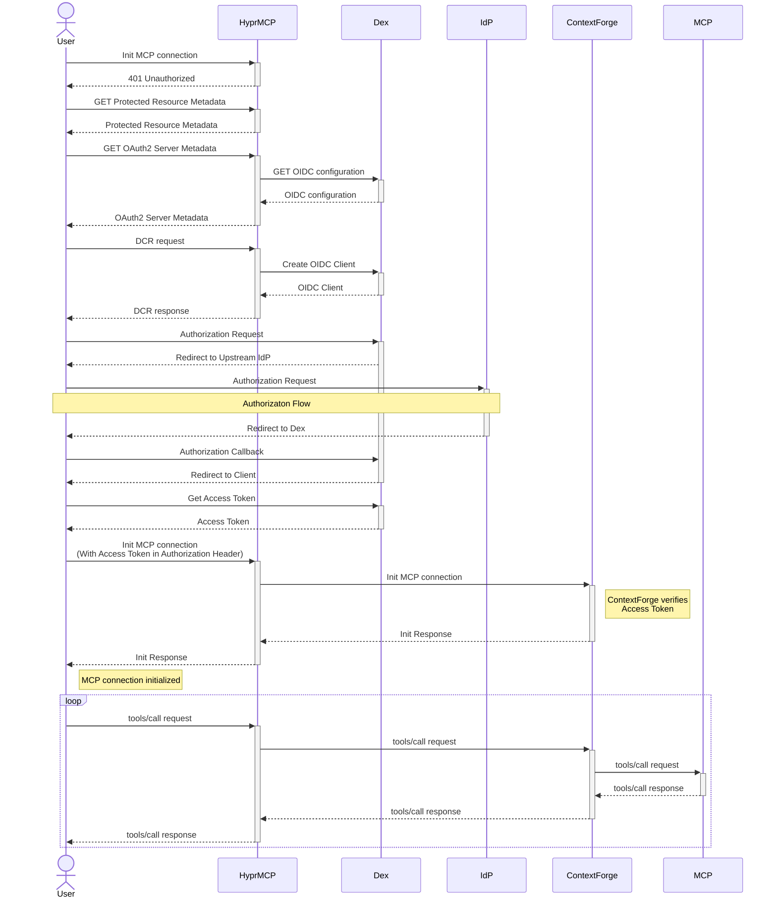

# Dynamic Client Registration with HyprMCP

To make it easier for users to install an MCP server, you can set up OAuth2 authentication to avoid manual API token configuration.
However, since the MCP specification requires OAuth2 dynamic client registration, which most SSO providers do not support, some additional setup is required.
The [HyprMCP Gateway](https://github.com/hyprmcp/mcp-gateway) is an open-source reverse proxy for MCP servers that allows you to add this capability.

This tutorial will guide you through the process of setting up ContextForge with HyprMCP to enable OAuth2 support for your virtual MCP servers.

## Architecture Overview

### Components

| Component       | Description                                            |
| --------------- | ------------------------------------------------------ |
| HyprMCP Gateway | Reverse proxy for MCP servers that adds OAuth2 support |
| Dex             | OpenID Connect server provider                         |
| IdP             | (optional) Upstream identity provider                  |
| ContextForge    | MCP gateway                                            |
| MCP             | Upstream MCP server                                    |

### Flow



## Prerequisites

- **Docker**
- **Docker Compose**
- **SQLite3**

## Deployment Steps

This section guides you through the deployment process of all the required services.
The final compose file will be at the end.

### Step 1: Dex IdP

Create a `docker-compose.yaml` file with the following content:

```yaml
services:
    hyprmcp-dex:
        image: ghcr.io/dexidp/dex:v2.43.1-alpine
        command: ["dex", "serve", "/config.yaml"]
        ports:

            - 5556:5556
            - 5557:5557
        healthcheck:
            test: wget http://localhost:5556/.well-known/openid-configuration -O -
            interval: 5s
            start_period: 10s
            start_interval: 1s
        volumes:

            - type: bind
              source: config/hyprmcp-dex.yaml
              target: /config.yaml
              read_only: true

            - type: bind
              source: ./data
              target: /data
        #env_file:
        #  - config/.dex.secret.env
```

Then, create `config/hyprmcp-dex.yaml` with the following content:

```yaml
issuer: http://localhost:5556
web:
    http: 0.0.0.0:5556
    allowedOrigins: ["*"]
grpc:
    addr: 0.0.0.0:5557
storage:
    type: sqlite3
    config:
        file: /data/dex.db
oauth2:
    skipApprovalScreen: true
enablePasswordDB: true
expiry:
    signingKeys: 8760h # 1 year
staticPasswords:

    - email: "admin@example.com"
      # bcrypt hash of the string "password" for user admin: $(echo password | htpasswd -BinC 10 admin | cut -d: -f2)
      hash: "$2a$10$2b2cU8CPhOTaGrs1HRQuAueS7JTT5ZHsHSzYiFPm1leZck7Mc8T4W"
      username: "admin"
      userID: "08a8684b-db88-4b73-90a9-3cd1661f5466"
#connectors:
#  - type: github
#    id: github
#    name: GitHub
#    config:
#      clientID: {{ .Env.GITHUB_CLIENT_ID }}
#      clientSecret: {{ .Env.GITHUB_CLIENT_SECRET }}
#      redirectURI: http://localhost:5556/callback
```

Optionally, you can enable the GitHub upstream IdP by uncommenting the relevant sections and creating `config/.dex.github.env` with the following content:

```env
GITHUB_CLIENT_ID=your_client_id
GITHUB_CLIENT_SECRET=your_client_secret
```

Refer to the GitHub documentation for more information on how to obtain the client ID and secret.

Once you're done, you can start the Dex server:

```shell
docker compose up -d
```

### Step 2: Extract signing keys

To get the signing keys from the Dex database, you can use the following command:

```shell
sqlite3 -readonly data/dex.db "select signing_key from keys"
```

This returns the signing key used by Dex in the JWK format.
You can convert it to PEM format using an [online tool](https://8gwifi.org/jwkconvertfunctions.jsp).
Write the public and private keys to files `config/public.pem` and `config/private.pem` respectively.

This step is necessary to ensure that ContextForge can verify the JWTs issued by Dex.

### Step 3: ContextForge

Add the ContextForge service to your compose file (put it in the `services` section):

```yaml
context-forge:
    image: ghcr.io/ibm/mcp-context-forge:1.0.0-BETA-2
    ports:

        - 4444:4444
    volumes:

        - type: bind
          source: ./data
          target: /data

        - ./config/public.pem:/opt/public.pem:ro
        - ./config/private.pem:/opt/private.pem:ro
    env_file:

        - config/context-forge.env
    environment:
        JWT_ALGORITHM: RS256
        JWT_PUBLIC_KEY_PATH: /opt/public.pem
        JWT_PRIVATE_KEY_PATH: /opt/private.pem
        JWT_AUDIENCE_VERIFICATION: false
        JWT_ISSUER_VERIFICATION: false
        JWT_ISSUER: http://localhost:5556
        DATABASE_URL: sqlite:////data/context-forge.db
        HOST: 0.0.0.0
        PORT: "4444"
        MCPGATEWAY_UI_ENABLED: true
        MCPGATEWAY_ADMIN_API_ENABLED: true
        PLATFORM_ADMIN_EMAIL: admin@example.com
        PLATFORM_ADMIN_PASSWORD: changeme
        AUTH_REQUIRED: false
        MCP_CLIENT_AUTH_ENABLED: false
        TRUST_PROXY_AUTH: true
```

Start the new services, again, using `docker compose up -d`.

### Step 5: MCP Server Setup

For this tutorial we will use the Context7 MCP server as an example, but you can use any MCP server you want.
To get started, go to https://context7.com/ and create an account. Note down your API key, as you will need it shortly.

Next, open ContextForge by navigating to http://localhost:4444.
Log in with the email/password credentials (admin@example.com / changeme) and configure the Context7 MCP server.
To do so, go to "MCP Servers" and at the bottom of the page:

- Enter `https://mcp.context7.com/mcp` as the MCP Server URL
- Select Transport Type "Streamable HTTP"
- Select Authentication Type "Bearer Token"
- Enter your Context7 API key as the Token
  Then, go to "Virtual Servers" and add a new server with the Context7 tools associated.
  Copy the UUID of this virtual MCP server and save it for the next step.

### Step 6: HyprMCP Gateway

Add the [HyprMCP Gateway](https://github.com/hyprmcp/mcp-gateway) service to your compose file:

```yaml
hyprmcp-gateway:
    image: ghcr.io/hyprmcp/mcp-gateway:0.2.6
    command: ["serve", "--config", "/opt/config.yaml"]
    ports:

        - 9000:9000
    volumes:

        - type: bind
          source: config/hyprmcp-gateway.yaml
          target: /opt/config.yaml
          read_only: true
    depends_on:
        hyprmcp-dex:
            condition: service_healthy
            required: true
    network_mode: host
```

Also, create the config file `config/hyprmcp-gateway.yaml` with the following content:

```yaml
host: http://localhost:9000/
authorization:
    server: http://localhost:5556/
    authorizationProxyEnabled: false
    serverMetadataProxyEnabled: true
    dynamicClientRegistration:
        enabled: true
        publicClient: true
dexGRPCClient:
    addr: localhost:5557
proxy:

    - path: /context-forge/mcp
      http:
          # replace "SERVER_UUID" with your virtual MCP server UUID from the previous step
          url: http://localhost:4444/servers/SERVER_UUID/mcp
      authentication:
          enabled: true
```

Start the service with `docker compose up -d`.

## Testing

To test the virtual MCP server with OAuth2, you can use the MCP inspector tool:

```
npx @modelcontextprotocol/inspector@latest
```

It should open a browser window with the MCP inspector tool. On the left side, enter the URL of the HyprMCP Gateway `http://localhost:9000/context-forge/mcp` and press "Connect".
You should get redirected to the login page of the Dex IdP service for authentication.
When authentication is successful, you should be redirected back to the MCP inspector tool where it should now display "connected".
In the top navigation bar, click on "Tools", then click "List Tools".
Choose a tool from the list and run it via the right side panel.

## Complete Compose File

```yaml
services:
    hyprmcp-dex:
        image: ghcr.io/dexidp/dex:v2.43.1-alpine
        command: ["dex", "serve", "/config.yaml"]
        ports:

            - 5556:5556
            - 5557:5557
        healthcheck:
            test: wget http://localhost:5556/.well-known/openid-configuration -O -
            interval: 5s
            start_period: 10s
            start_interval: 1s
        volumes:

            - type: bind
              source: config/hyprmcp-dex.yaml
              target: /config.yaml
              read_only: true

            - type: bind
              source: ./data
              target: /data
        #env_file:
        #  - config/.dex.secret.env

    hyprmcp-gateway:
        image: ghcr.io/hyprmcp/mcp-gateway:0.2.6
        command: ["serve", "--config", "/opt/config.yaml"]
        ports:

            - 9000:9000
        volumes:

            - type: bind
              source: config/hyprmcp-gateway.yaml
              target: /opt/config.yaml
              read_only: true
        depends_on:
            hyprmcp-dex:
                condition: service_healthy
                required: true
        network_mode: host

    context-forge:
        image: ghcr.io/ibm/mcp-context-forge:1.0.0-BETA-2
        ports:

            - 4444:4444
        volumes:

            - type: bind
              source: ./data
              target: /data

            - ./config/public.pem:/opt/public.pem:ro
            - ./config/private.pem:/opt/private.pem:ro
        env_file:

            - config/context-forge.env
        environment:
            JWT_ALGORITHM: RS256
            JWT_PUBLIC_KEY_PATH: /opt/public.pem
            JWT_PRIVATE_KEY_PATH: /opt/private.pem
            JWT_AUDIENCE_VERIFICATION: false
            JWT_ISSUER_VERIFICATION: false
            JWT_ISSUER: http://localhost:5556
            DATABASE_URL: sqlite:////data/context-forge.db
            HOST: 0.0.0.0
            PORT: "4444"
            MCPGATEWAY_UI_ENABLED: true
            MCPGATEWAY_ADMIN_API_ENABLED: true
            PLATFORM_ADMIN_EMAIL: admin@example.com
            PLATFORM_ADMIN_PASSWORD: changeme
            AUTH_REQUIRED: false
            MCP_CLIENT_AUTH_ENABLED: false
            TRUST_PROXY_AUTH: true
```

## Conclusion

This tutorial demonstrates how to set up ContextForge together with [HyprMCP](https://hyprmcp.com/) to enable secure, efficient and easy-to-use OAuth2 authentication for virtual MCP servers.

### Future Work

Interoperability could be further improved by ContextForge adding support for SSO using generic OIDC providers, as well as the HyprMCP gateway adding other DCR compatibility modes on top of the existing one based on Dex IdP.

### Further Links

- Explore the [HyprMCP](https://hyprmcp.com/) documentation for more advanced features and integrations.
- Read our in-depth guide on [Building Supabase-like OAuth Authentication For MCP Servers](https://hyprmcp.com/blog/mcp-server-authentication/)
