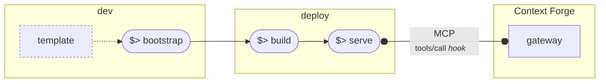

# Plugin Lifecycle

The plugin framework includes CLI tools to help you create, test, and deploy your plugins.

## Development Flow

The plugin development workflow  follows a straightforward workflow that gets you from idea to running plugin quickly.



The process breaks down into these main steps:

- **Bootstrap**: Start with a plugin template and run the bootstrap command to set up your project structure
- **Build**: Compile and package your plugin code
- **Serve**: Launch a local development server to test your plugin
- **Connect**: Your served plugin automatically integrates with Context Forge's gateway via MCP (Model Context Protocol), using tool calls over standardized hooks for seamless communication

This streamlined approach lets developers focus on building functionality rather than wrestling with configuration, while ensuring plugins work smoothly within the broader Context Forge ecosystem.

### Bootstrap

Creating a new plugin for Context Forge only takes a few minutes!

Using the `mcpplugins` tool (installed with Context Forge),

```bash
mcpplugins bootstrap --destination your/plugin/dir
```

The interactive prompt you guide you to enter plugin metadata, and will boostrap a complete plugin project for you including everything you need to kick the tires writing your new plugin.

For a full list of options, check:

```bash
mcpplugins bootstrap --help
```

!!! tip
        When prompted for the choosing the plugin type, select `external` to create standalone plugins (with their own lock files and dependency trees).
        Select `native` if you want to create a plugin that embeds and gets loaded directly into the gateway environment.


The examples under the `plugins` directory in the gateway repository serve as a guide of how to develop and test `native` plugins.

The following instructions apply to `external` plugins. First, change directory to work with your newly bootstrapped plugin:

```bash
cd your/plugin/dir
cp .env.template .env
```

### Configuration

There are two main configuration files for your project.

```bash
./resources
    /plugins/config.yaml # configuration for your plugin and the plugin loader
    /runtime/config.yaml # configuration for the plugin server runtime
```

Inspect those two files and get familiar with them. There are many options you can customize, depending on your use case.

### Dependencies

Plugins are Python packages with dependencies managed by `uv`. Just like the gateway, you can add, lock, lint, and ensure that best practices are followed when creating your plugins. To install dependencies with dev packages (required for linting and testing), run:

```bash
make install-dev
```

Alternatively, you can also install it in editable mode:

```bash
make install-editable
```

### Test

To run all unit tests for your plugins:

```bash
make test
```

### Build

To build a container image (runtime) containing a standardized plugin server, run:

```bash
make build
```

### Serve

To start the plugin server:

```bash
make start
```

By default, this will start a Streamable HTTP MCP server on `http://localhost:8000/mcp`.

You can run `mcp inspector` to check your new server (note, it requires `npm`):

```bash
npx @modelcontextprotocol/inspector
```

## Plugin Templates

The gateway ships with ready‑to‑use plugin templates under `plugin_templates/` that the bootstrap tool uses. You can also copy them manually if you prefer.

Location and contents:

- `plugin_templates/native`
  - `plugin.py.jinja`: Plugin class skeleton extending `Plugin`
  - `plugin-manifest.yaml.jinja`: Manifest metadata (description, author, version, available_hooks)
  - `config.yaml.jinja`: Example entry to add in `plugins/config.yaml`
  - `__init__.py.jinja`, `README.md.jinja`

- `plugin_templates/external`
  - `{{ plugin_name }}/plugin.py.jinja`: External plugin implementation skeleton
  - `resources/plugins/config.yaml.jinja`: Plugin loader config for server
  - `resources/runtime/config.yaml.jinja`: External server runtime config
  - `pyproject.toml.jinja`, `MANIFEST.in.jinja`, `.ruff.toml`, `.dockerignore`, `Containerfile`
  - `Makefile.jinja`, `run-server.sh`: Build and serve helpers
  - `tests/`: Example tests and pytest config

Placeholders in filenames and files (e.g., `{{ plugin_name.lower()... }}`) are filled by the bootstrap tool. If copying manually, replace them with your plugin's name and details.

Using the templates via the CLI (recommended):

```bash
# Creates a new plugin from templates, asks interactive prompts
mcpplugins bootstrap --destination your/plugin/dir

# Pass --type to select template directly
mcpplugins bootstrap --destination your/plugin/dir --type native   # or external
```

After bootstrapping, follow the steps above to install deps, run tests, build, and serve.

## Gateway Integration

Let's assume you have boostrapped the following plugin (`resources/plugins/config.yaml`) with default runtime (`resources/runtime/config.yaml`) options:

```yaml
plugins:

  - name: "MyFilter"
    kind: "myfilter.plugin.MyFilter"
    description: "A filter plugin"
    version: "0.1.0"
    author: "Frederico Araujo"
    hooks: ["prompt_pre_fetch", "prompt_post_fetch", "tool_pre_invoke", "tool_post_invoke"]
    tags: ["plugin"]
    mode: "enforce"  # enforce | permissive | disabled
    priority: 150
    conditions:
      # Apply to specific tools/servers
      - server_ids: []  # Apply to all servers
        tenant_ids: []  # Apply to all tenants
    config:
      # Plugin config dict passed to the plugin constructor

# Plugin directories to scan
plugin_dirs:

  - "myfilter"

# Global plugin settings
plugin_settings:
  parallel_execution_within_band: true
  plugin_timeout: 30
  fail_on_plugin_error: false
  enable_plugin_api: true
  plugin_health_check_interval: 60
```

To integrate this plugin with the gateway, all you need to do is copying the following configuration under the `plugins` list in the gateway's `plugins/config.yaml` file:

```yaml
plugins:
  # External Filter Plugin
  - name: "MyFilter"
    kind: "external"
    priority: 10 # adjust the priority
    mcp:
      proto: STREAMABLEHTTP
      url: http://localhost:8000/mcp

To use Streamable HTTP over a Unix domain socket (no TCP port):

```yaml
plugins:

  - name: "MyFilter"
    kind: "external"
    priority: 10
    mcp:
      proto: STREAMABLEHTTP
      url: http://localhost/mcp
      uds: /var/run/mcp-plugin.sock
```
```

To use STDIO instead of HTTP:

```yaml
plugins:

  - name: "MyFilter"
    kind: "external"
    priority: 10
    mcp:
      proto: STDIO
      cmd: ["python", "path/to/your/plugin_server.py"]
      env:
        PLUGINS_CONFIG_PATH: "/opt/plugins/config.yaml"
      cwd: "/opt/plugins"
      # Relative script paths are resolved from cwd when provided
      # or: script: path/to/your/plugin_server.py  # .py/.sh or executable
```

Then, start the gateway:

```bash
make serve
```

!!! note
        `PLUGINS_ENABLED=true` should be set in your gateway `.env` file.
